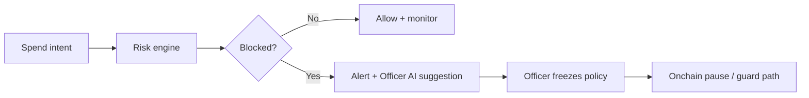

# Arb Guardian

<p align="center">
  
</p>

<p align="center">
  <strong>Guild bank protection for gaming teams</strong><br/>
  Review spends before anyone signs. Block scams. Freeze when it matters.
</p>

<p align="center">
  <a href="https://arb-guardian.vercel.app"></a>
  
  
</p>

**Live product:** [arb-guardian.vercel.app](https://arb-guardian.vercel.app)  
**Repo:** [github.com/thesithunyein/arb-guardian](https://github.com/thesithunyein/arb-guardian)

---

## What it is

Arb Guardian is an operations product for **guild officers** who share one bank for prizes and payouts. Fake marketplaces and over-budget transfers drain those pots. Officers review a spend, get a clear Allow / Block decision, and can freeze spending with a human click.

Officer AI suggests the next playbook. It **cannot move funds**, change allowlists, or freeze without an officer confirming.

## Who it’s for

- Guild / clan treasurers and officers  
- Esports managers running a shared prize pot  
- Co-signers who need a shared alert + freeze log  

Not a playable mini-game. Not a generic DeFi trading console.

## Core capabilities

| Surface | What officers get |
| --- | --- |
| **Review** | Pending spend receipt — amount, counterparty, allowlist, budget |
| **Decision** | Deterministic Allow / Block with plain-language outcome |
| **Officer AI** | Bounded playbook suggestion + hard permission limits |
| **Alerts** | Shared queue — acknowledge, freeze, or dismiss |
| **Playbooks** | Risk → response mapping with measurable eval accuracy |
| **Vault** | Live contract proof on Arbitrum Sepolia + Robinhood Chain |
| **Officer wallet** | Connect + signed guild save; activity stays tied to that officer wallet |

## How it works



1. Officer opens a spend for review.  
2. Deterministic rules score destination, method, allowlist, and daily budget.  
3. If blocked, an alert opens with a recommended playbook.  
4. Officer confirms freeze — contracts enforce pause / guard constraints.  
5. Activity log keeps a shared audit trail.

## Architecture

| Layer | Role |
| --- | --- |
| **PolicyManager** | Allowlists, daily limits, RBAC, pausable circuit breaker |
| **ExecutionGuard** | Pre-execution validation and spend recording |
| **SafeTreasuryGuard** | Safe-compatible transaction guard for enrolled treasuries |
| **API risk engine** | Deterministic scoring (TypeScript) |
| **Agent coordinator** | Maps evidence → playbooks within hard bounds |
| **Web app** | Officer console (React) — Review, Alerts, Playbooks, Vault |

Details: [`docs/architecture.md`](docs/architecture.md) · [`docs/agent-permissions-matrix.md`](docs/agent-permissions-matrix.md)

## Live networks

Dual-chain deploy — same product loop on both networks. Full addresses and explorers: [`docs/live-deployment.md`](docs/live-deployment.md)

| Network | Status |
| --- | --- |
| **Arbitrum Sepolia** | Live — PolicyManager, ExecutionGuard, SafeTreasuryGuard, enrolled Safe |
| **Robinhood Chain Testnet** | Live — twin deploy for the same loop |

## Stack

- **Contracts:** Solidity, OpenZeppelin (AccessControl, Pausable), Hardhat  
- **API:** TypeScript, deterministic risk engine + agent eval harness  
- **Web:** React + Vite  
- **Ops:** `npm run quality:gate` — contract tests, API tests, agent eval (12/12), builds  

## Develop

```bash
npm install
npm run quality:gate
npm run dev -w apps/web
```

Optional API: `npm run dev -w apps/api` (or use the Vercel `/api` routes on the live deploy).

## Security model (short)

- Onchain policy is source of truth for limits and pause.  
- Officer AI is **suggest-only** — no fund movement, no allowlist edits.  
- Freeze requires an explicit officer action in Alerts.  
- Safe path uses an enrolled treasury + transaction guard.

## License

MIT
