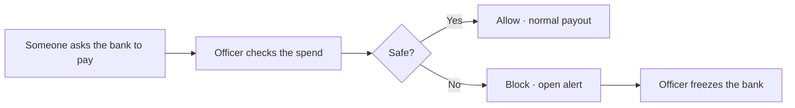

# Arb Guardian

<p align="center">
  
</p>

<p align="center">
  <strong>The most fun way to protect your guild bank</strong><br/>
  Your guild shares one bank. Fake shops try to drain it. Check spends before anyone signs.
</p>

<p align="center">
  <a href="https://arb-guardian.vercel.app"></a>
</p>

---

## In one sentence

**Arb Guardian** helps guild officers stop bad spends on a shared prize pot — check a spend, get allow/block, freeze the bank if needed.

**Play → [arb-guardian.vercel.app](https://arb-guardian.vercel.app)**  
No wallet needed to try the practice spends.

## How it works



1. Guild keeps prize / payout money in one bank  
2. A marketplace or payout asks to spend  
3. You check it in the app  
4. Safe → allow · Risky → block, then freeze from Alerts  

## Who it’s for

Guild officers, clan managers, and esports teams that share a prize pot.

## Try it in a minute

1. Press start  
2. Read the 60-second story  
3. Tap **Try a scam check** (unknown marketplace)  
4. If blocked → Alerts → **Freeze guild spending**

## For builders

Advanced architecture, contracts, and deploy proof live in docs — not on the product home screen:

- [`docs/architecture.md`](docs/architecture.md) — system design  
- [`docs/live-deployment.md`](docs/live-deployment.md) — Arbitrum + Robinhood addresses  
- [`docs/agent-permissions-matrix.md`](docs/agent-permissions-matrix.md) — what automation can / cannot do  

```bash
npm install
npm run dev -w apps/web
```

## License

MIT
