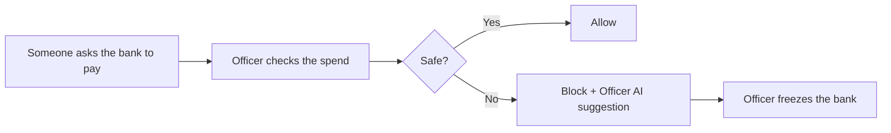

# Arb Guardian

<p align="center">
  
</p>

<p align="center">
  <strong>The most fun way to protect your guild bank</strong><br/>
  Your guild shares one bank. Fake shops try to drain it. Check spends before anyone signs.
</p>

<p align="center">
  <a href="https://arb-guardian.vercel.app"></a>
  
</p>

---

## Launch loop (60 seconds)

1. **Press start**  
2. **Check spend** — unknown marketplace approval  
3. **Block** — Officer AI suggests freeze (cannot move funds)  
4. **Alerts → Freeze** — human click  
5. **Live networks** — Arbitrum + Robinhood explorers  

**Play → [arb-guardian.vercel.app](https://arb-guardian.vercel.app)** · Practice mode · no wallet needed to try

## How it works



## Who it’s for

Guild officers, clan managers, and esports teams that share a prize pot.

## For builders

- [`docs/architecture.md`](docs/architecture.md) — system design  
- [`docs/live-deployment.md`](docs/live-deployment.md) — Arbitrum + Robinhood addresses  
- [`docs/agent-permissions-matrix.md`](docs/agent-permissions-matrix.md) — Officer AI bounds  
- [`docs/demo-video-script.md`](docs/demo-video-script.md) — 90s demo  

```bash
npm install
npm run quality:gate
npm run dev -w apps/web
```

## License

MIT
