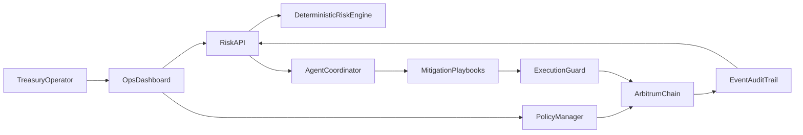

# Arb Guardian

<p align="center">
  
</p>

<p align="center">
  <strong>Treasury risk operations for Arbitrum-native teams</strong><br/>
  Onchain policy guardrails · Evidence-first risk scoring · Policy-bounded incident response
</p>

<p align="center">
  <a href="https://github.com/thesithunyein/arb-guardian">GitHub</a> ·
  <a href="https://arb-guardian.vercel.app">Live dashboard</a>
</p>

---

## Product

Arb Guardian helps treasury signers and ops leads **block unsafe transactions before execution**, then run auditable mitigation playbooks with deterministic evidence — not opaque AI text.

## Architecture



### Shield control loop

1. **Policy** — allowlists + daily limits onchain (`PolicyManager`)
2. **Assess** — deterministic rule scoring with explicit rule IDs
3. **Block** — `ExecutionGuard` rejects policy violations
4. **Incident** — agent recommends a bounded playbook
5. **Mitigate** — operator action is logged in the audit trail

## Monorepo

- `apps/web` — branded operator dashboard
- `apps/api` — risk engine + agent coordinator
- `packages/contracts` — Solidity policy/guard contracts
- `packages/shared` — shared schemas
- `docs` — architecture, judging, launch materials

## Quick start

```bash
npm install
npm run dev -w apps/api
npm run dev -w apps/web
npm run test -w packages/contracts
```

## Brand

| Token | Value |
| --- | --- |
| Deep teal | `#0B3A42` |
| Mid teal | `#14606B` |
| Cyan highlight | `#5FD0C8` |
| Paper | `#F4F8F8` |
| Display font | Source Serif 4 |
| UI font | Manrope |

Logo assets:
- Main mark: `docs/assets/logo.png` / `apps/web/public/logo.png`
- Browser tab icon: `apps/web/public/favicon.png`
- Theme: light/dark mode with system preference + persistence

## Live

- Product: https://arb-guardian.vercel.app
- Repo: https://github.com/thesithunyein/arb-guardian

## Release commands

- `npm run quality:gate`
- `npm run preflight`
- `npm run push:audit`
- `npm run submission:finalize`
- `npm run demo:seed` / `npm run demo:smoke`

## Security baseline

- RBAC roles for policy and execution
- Pausable circuit breaker
- Event-rich audit trail
- Deterministic risk evidence (no fabricated outputs)

## License

MIT
