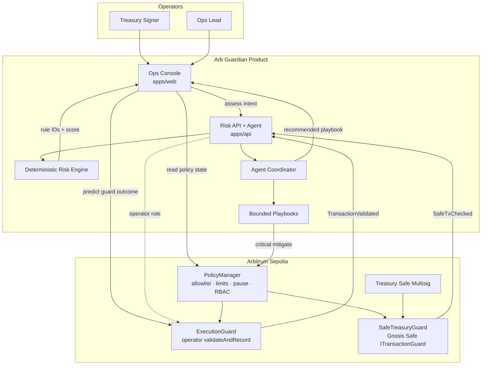
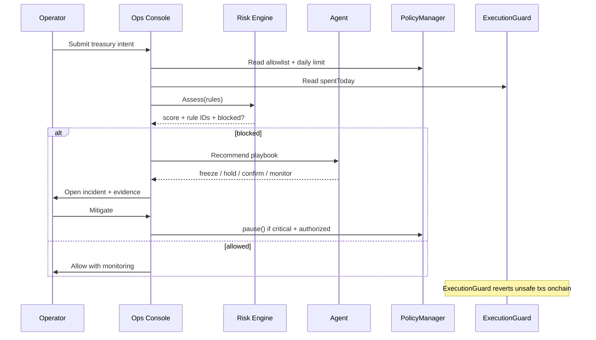
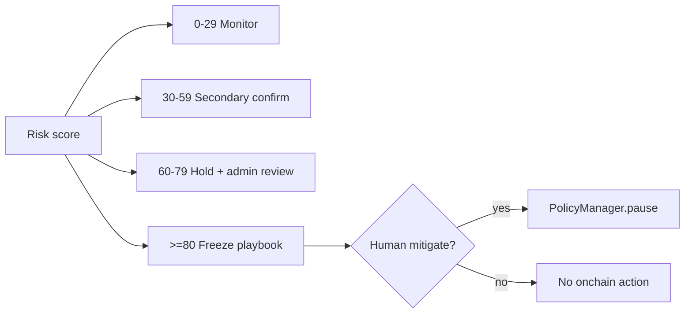

# Arb Guardian

<p align="center">
  
</p>

<p align="center">
  <strong>Treasury risk operations for Arbitrum-native teams</strong><br/>
  Onchain policy guardrails · Evidence-first risk scoring · Policy-bounded incident response
</p>

<p align="center">
  <a href="https://arb-guardian.vercel.app"></a>
  <a href="https://github.com/thesithunyein/arb-guardian"></a>
  
  
  
  
</p>

<p align="center">
  <a href="https://arb-guardian.vercel.app">Live product</a> ·
  <a href="https://github.com/thesithunyein/arb-guardian">GitHub</a> ·
  <a href="https://sepolia.arbiscan.io/address/0x4f3dC29Ed0c8844E31fD84c3eE22C1C94158Cf76">PolicyManager</a> ·
  <a href="https://sepolia.arbiscan.io/address/0x10fbe21ccb611A2aBF12a784C67278eAf6dE6124">ExecutionGuard</a> ·
  <a href="https://sepolia.arbiscan.io/address/0xcba30F60BE3FB0fB0e9db0C816c4ab9Fa2f7b211">SafeTreasuryGuard</a>
</p>

---

## Why it wins

Treasury teams lose funds to unsafe approvals, weak allowlists, and slow incident response. Arb Guardian is a **launch-ready risk ops console** that:

1. Enforces policy **onchain** on Arbitrum
2. Scores intent with **deterministic rule IDs** (no opaque AI text)
3. Opens incidents and recommends **policy-bounded agent playbooks**
4. Leaves an auditable trail operators can defend to stakeholders

Built for **Overall Prize** + **Best Agentic** judging: smart contract quality, PMF, innovation, and real problem solving — with **live Arbitrum Sepolia deployment** for qualification.

## Live Arbitrum deployment

| Contract | Address | Explorer |
| --- | --- | --- |
| PolicyManager | `0x4f3dC29Ed0c8844E31fD84c3eE22C1C94158Cf76` | [Arbiscan](https://sepolia.arbiscan.io/address/0x4f3dC29Ed0c8844E31fD84c3eE22C1C94158Cf76) |
| ExecutionGuard | `0x10fbe21ccb611A2aBF12a784C67278eAf6dE6124` | [Arbiscan](https://sepolia.arbiscan.io/address/0x10fbe21ccb611A2aBF12a784C67278eAf6dE6124) |
| SafeTreasuryGuard | `0xcba30F60BE3FB0fB0e9db0C816c4ab9Fa2f7b211` | [Arbiscan](https://sepolia.arbiscan.io/address/0xcba30F60BE3FB0fB0e9db0C816c4ab9Fa2f7b211) |

Deploy txs:
- PolicyManager: [`0x9400…afc2`](https://sepolia.arbiscan.io/tx/0x9400d2f97914093c516c38242d86d6368d4e352dc867cc9ef735a6c6bd00afc2)
- ExecutionGuard: [`0xad9c…c1a0`](https://sepolia.arbiscan.io/tx/0xad9c6ca6b58c06e10b34701776cf135d97cb5c11a534ce02bb781df189afc1a0)
- SafeTreasuryGuard: [`0x809c…3f1b`](https://sepolia.arbiscan.io/tx/0x809ca1051a8997a307c8e9d0bc66348e01eb51c45564e6425fb59c9fa14c3f1b)

**Safe path:** set `SafeTreasuryGuard` as the Safe’s transaction guard, then `setSafeEnrollment(safe, true)`.

## Architecture

### System control plane



### Shield decision loop



### Agentic permission matrix



## Product workflows

1. **Policy** — allowlisted counterparties + wallet daily limits (RBAC)
2. **Assess** — deterministic rules with explicit `RULE_*` evidence
3. **Block** — `ExecutionGuard` reverts violations; console predicts outcome
4. **Incident** — agent recommends a bounded playbook
5. **Mitigate** — acknowledge / mitigate / ignore with audit trail

## Monorepo

| Path | Role |
| --- | --- |
| `apps/web` | Launch console (dark-default, onchain reads) |
| `apps/api` | Risk API, agent coordinator, eval harness |
| `packages/contracts` | Solidity PolicyManager + ExecutionGuard |
| `packages/shared` | Zod schemas / shared types |
| `docs` | Judging, security, deploy runbooks |

## Quick start

```bash
npm install
npm run env:create          # real local + Vercel-ready secrets
npm run deploy:p0           # Sepolia deploy when funded
npm run dev -w apps/api
npm run dev -w apps/web
npm run quality:gate
```

## Judging map

| Criterion | Evidence |
| --- | --- |
| Deployed on Arbitrum | Live Sepolia addresses above |
| Smart contract quality | OZ RBAC/Pausable, custom errors, Hardhat tests |
| Product-market fit | Safe multisig guard + treasury ops console |
| Innovation | Deterministic evidence + bounded agentic playbooks |
| Real problem solving | Pre-execution block in Safe + ops incident lifecycle |
| Best agentic | Eval harness (12 scenarios, accuracy 1.0) + permissions matrix |

## Brand

| Token | Value |
| --- | --- |
| Near-black | `#05070D` |
| Electric blue | `#2B6BFF` |
| Font | Space Grotesk + IBM Plex Mono |

## Security baseline

- RBAC for policy and execution roles
- Pausable circuit breaker
- Zero-address / invalid-amount guards
- Event-rich audit trail
- Deterministic risk evidence (no fabricated outputs)

## License

MIT
