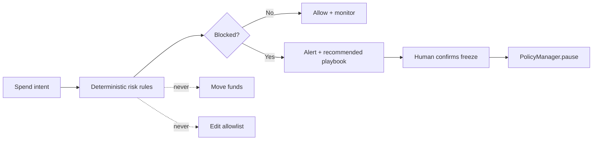

# Arb Guardian

<p align="center">
  
</p>

<p align="center">
  <strong>Give an agent, bot or operator money without giving it the ability to drain the account</strong><br/>
  On-chain spend policy a treasury cannot exceed — enforced by a contract, not by trust.
</p>

<p align="center">
  <a href="https://arb-guardian.vercel.app"></a>
  
  
  
</p>

**Live product:** [arb-guardian.vercel.app](https://arb-guardian.vercel.app)
**Repo:** [github.com/thesithunyein/arb-guardian](https://github.com/thesithunyein/arb-guardian)

---

## The problem

Delegating money is currently all-or-nothing. The moment a treasury lets an AI agent, a keeper
bot, or a junior operator move funds, it also grants the ability to move *all* of them. Every
control available today is either **static** ("fund a separate account and hope") or
**manual** ("approve every transaction"), and manual approval defeats the entire point of
automation.

The gap is not detection. It is **enforceable bounds**: a limit the delegate physically cannot
exceed, that does not depend on the delegate's prompt, the vendor's custody arrangement, or an
off-chain API it can route around.

This is not hypothetical. On Robinhood Chain, one crew ran 56 token launches from July 10 to
September 23, 2026 and took about **$15.5M**, with buyers losing **$13.3M** — of which **$9.4M**
came from users buying inside consumer apps who never saw an on-chain flag
([Bitquery](https://bitquery.io/investigations/robinhood-chain-rug-pull-crew), published
September 28, 2026). Meanwhile Robinhood has opened agentic trading to all customers and is
rolling out agentic accounts to the mainstream, with "trade continuously" on the roadmap — and
you cannot have continuous trading *and* per-trade human approval.

Arb Guardian is the missing layer: **policy that a contract enforces, so the delegate cannot
exceed it even if it wants to.**

## What it is

Three Solidity contracts plus an operator console:

| Layer | Role |
| --- | --- |
| **PolicyManager** | Source of truth. Native-asset allowlist and daily caps, plus a **token lane** (register an ERC-20 like USDG, allowlist counterparties, set a per-wallet daily cap), RBAC, pausable circuit breaker |
| **ExecutionGuard** | Operator/API pre-execution validation and spend recording. Holds no funds and cannot move any |
| **SafeTreasuryGuard** | A **real Gnosis Safe v1.4.1 transaction guard**. Once installed, a policy-violating transaction reverts inside the Safe's own `execTransaction` |
| **API risk engine** | Deterministic scoring in TypeScript — no model, no LLM call anywhere in the repo |
| **Web console** | Review / Allow-Block / Alerts / Playbooks / Vault |

## Where the enforcement actually happens

This is the part worth reading carefully, because it is where most treasury-guard projects are
vague.

`SafeTreasuryGuard` is installed as a **real Safe's guard**, the only way Safe 1.4.1 permits:
`GuardManager.setGuard` is `SelfAuthorized`, so it must arrive as an owner-approved
`execTransaction` that calls the Safe itself. From then on the guard sees every transaction
before it executes and can refuse it:

```solidity
// Delegates the check to the Safe before execution; a revert here reverts the whole Safe tx.
if (operation == Enum.Operation.DelegateCall) revert DelegateCallNotAllowed();
```

It routes three ways:

1. **Self-call** (`to == msg.sender`) — an owner-approved change to the Safe's own config
   (guard, modules, owners). Allowed through, since it is already gated by the Safe's threshold.
2. **Registered token** (`to` is e.g. USDG) — calldata is decoded and the **token** policy
   applies: recipient (or spender) must be allowlisted for that token, the movement must fit the
   token's daily cap, unlimited approvals are rejected, and an unrecognised call on a registered
   token is rejected rather than silently allowed.
3. **Everything else** — native lane: destination must be allowlisted, and any native value
   counts against the native cap.

Both lanes are **deny-by-default**, and spend is recorded *before* execution so the cap cannot be
bypassed by re-entrancy. If the inner call then fails, `checkAfterExecution` refunds the budget
instead of silently consuming it.

## Proof, not a demo

`packages/contracts/test/RealSafeGuard.test.ts` drives a **real Gnosis Safe v1.4.1** — real
singleton, real proxy factory, real compatibility fallback handler. Nothing here is a bespoke
"Safe-compatible" shell.

`npm run evidence -w packages/contracts` reproduces the whole proof and writes a
submission-ready artifact:

```
15/15 cases behaved as specified
Policy attestation: 11 amendments replayed, 6/6 decisions stamped.
```

The table it generates is the readable version of the claim, including every revert reason:

| # | Case | Expected | Observed | Revert reason |
| ---: | --- | --- | --- | --- |
| 1 | **Before** the guard is installed: the Safe pays a non-allowlisted address 1 ETH | allowed | allowed | — |
| 2 | **After** the guard is installed: the same payment | blocked | blocked | `CounterpartyNotAllowlisted(0x90F7…)` |
| 3 | Allowlisted vendor, above the 5 ETH daily cap | blocked | blocked | `DailyLimitExceeded(safe, 6e18, 5e18)` |
| 5 | 1,200 USDG to an allowlisted recipient, inside the 5,000 USDG cap | allowed | allowed | — |
| 6 | 6,000 USDG, above the cap | blocked | blocked | `TokenDailyLimitExceeded(token, safe, 7.2e9, 5e9)` |
| 9 | **Unlimited USDG approval** — the classic drain primitive | blocked | blocked | `UnlimitedApprovalNotAllowed(token, spender)` |
| 10 | Non-standard call on a registered token | blocked | blocked | `UnsupportedTokenCall(token, 0x40c10f19)` |
| 12 | Valid payment after an officer freeze | blocked | blocked | `PolicyManagerPaused()` |
| 13 | USDG cap cleared to zero | blocked | blocked | `TokenDailyLimitNotConfigured(token, safe)` |
| 14 | Owner calling `setGuard` directly, not through the Safe | blocked | blocked | `GS031` |
| 15 | After the native cap is raised 5 ETH → 6 ETH, the same vendor payment again | allowed | allowed | — (stamped with the **new** policy version) |

Full output: [`packages/contracts/evidence/guard-proof.md`](packages/contracts/evidence/guard-proof.md).
The script exits non-zero if any case drifts, so this table cannot silently go stale.

**Row 1 is the one that matters.** It is the same transaction as row 2, executed before the guard
was installed — and it settles. A screenshot of a blocked transaction proves nothing on its own.
The before/after pair is what shows the guard is the thing making the difference.

## Wiring an operator in

A runnable integration, not a snippet: `packages/contracts/examples/operator-spend.ts`. Four of its
eight rows:

```bash
npm run example:operator -w packages/contracts
```

```
  1  0.75 ETH → allowlisted vendor (inside the 2 ETH cap)          ALLOWED   v6 0xdff263390b…
  2  0.10 ETH → address nobody allowlisted                         DENIED    CounterpartyNotAllowlisted(0x90F7…)
  3  1.50 ETH → allowlisted vendor (1.75 ETH already spent today)  DENIED    DailyLimitExceeded(0x7099…, 2250000000000000000, 2000000000000000000)
  4  1,200 USDG → allowlisted payroll (inside the 5,000 USDG cap)  ALLOWED   v6 0xdff263390b…
  6  unlimited USDG approval to a market maker                    DENIED    UnlimitedApprovalNotAllowed(0x9fE4…)
  8  0.01 ETH from a key the policy never configured               DENIED    DailyLimitNotConfigured(0x976E…)

  3/8 spends were allowed; policy refused 5.
```

It shows the two patterns an operator client needs: **dry-run the policy with `staticCall` and
decode the custom error** so you get a reason before spending rather than a failed transaction
after, and **carry the policy version and digest** from the decision event into your own order
record. It runs in-process with no keys and no funding, and exits non-zero if a case drifts, so CI
runs it too.

One caveat stated plainly, because it is the difference between this and enforcement: an operator
holding the funds could skip this client. `ExecutionGuard` is the pre-flight oracle for a key you
control. When the money is in a multisig, install `SafeTreasuryGuard` and enforcement stops
depending on the operator's good behaviour.

## Policy attestation

A refusal is only meaningful against the policy that was actually in force when it happened.
Otherwise "the policy blocks that" is a claim about the policy *today*, and a limit that was
raised last week quietly rewrites history.

So policy is versioned and hash-chained. Every mutation — allowlist, cap, token registration,
pause — advances `policyVersion` and folds the change into `policyDigest`:

```solidity
policyDigest = keccak256(abi.encode(policyDigest, policyVersion, kind, params));
```

Each amendment emits `PolicyAmended(version, digest, kind, params, actor)`, including the
parameters verbatim, so the whole chain can be **recomputed from logs alone** — no trust in the
contract's own storage. Because every digest folds in its predecessor, editing an early
amendment changes every later digest.

Every decision record then carries the version and digest that judged it
(`TransactionValidated`, `TokenTransferValidated`, `TokenApprovalValidated`, `SafeTxChecked`,
`SafeTokenTxChecked`). An executed transfer can therefore be reconciled against the exact policy
that allowed it, months later.

The evidence pack does not just assert this — it replays the chain and cross-checks every stamped
decision:

```
| Amendments replayed from logs | 11 |
| Head policy version | 10 |
| Digest chain replay | 11/11 digests recomputed from logs |
| Allowed decisions stamped | 6/6 match a version in the amendment log |
| Distinct policy versions across decisions | 2 (proves the stamp tracks amendments, not a constant) |
```

One honest caveat: **blocked decisions revert, so they emit no logs of their own.** A refusal is
attributed to the policy version in force at its block, which the amendment log pins down
unambiguously. The inline stamp is what makes an *executed* transfer reconcilable after the fact.

## USDG

USDG is [natively issued on Robinhood Chain](https://globaldollar.com/newsroom/usdg-is-now-available-on-robinhood-chain-as-the-lending-asset-in-robinhood-s-new-earn-product)
and is the lending asset in Robinhood Earn. Treasury pots are held in stablecoins, not native
ETH, which is why the token lane exists and why policy is denominated in the token's own base
units.

USDG uses **6 decimals**, so a $5,000 daily cap is `5_000 * 10**6`. This matters: a policy
denominated in wei would treat `5e18` as "$5,000" and allow a million times the intended amount.
There is a test for exactly that mistake
(`exposes the 18-vs-6 decimal trap: a wei-sized number blows the USDG cap`).

The token lane is token-agnostic — register any ERC-20, allowlist its counterparties, cap it.
USDG is the first registration because it is the settlement asset of the chain this is built for.

```bash
# Register USDG and open a bounded lane at deploy time
USDG_ADDRESS=0x… \
USDG_TREASURY_ADDRESS=0x… \
USDG_DAILY_LIMIT_UNITS=5000000000 \
USDG_RECIPIENT=0x… \
npm run deploy:robinhood -w packages/contracts
```

## Why on-chain, and why Arbitrum / Robinhood Chain

Because the bound has to hold when the delegate misbehaves. An off-chain API cap is only as good
as the delegate's willingness to call it. A contract-enforced cap holds regardless of what the
agent's prompt says, and any third party can verify it — the policy and every refusal are on a
public ledger.

A per-transaction policy check has to be cheap enough to run on every spend, which means an L2.
Arbitrum is where the mature DeFi and the existing Safe tooling live; Robinhood Chain is where
the agents and retail users are actually being pointed, and it is where USDG settles.

## Who it is for

| User | The spend they cannot bound today |
| --- | --- |
| **Agent / bot operators** | An automated trader or keeper with a hot key and no enforceable ceiling |
| **On-chain orgs and DAOs** | Contributors and service bots paid from a shared multisig |
| **Launchpads and consumer apps** | Delegated operations around user funds, where the app layer routes money it does not control |
| **Gaming guilds and esports pots** *(the original use case)* | A shared prize pot where a fake marketplace or an over-budget transfer drains the whole thing |

Plain language first. Crypto rails underneath. Not a mini-game. Not a trading console.

## Operator console

| Surface | What you get |
| --- | --- |
| **Review** | Pending spend receipt — amount, counterparty, allowlist, budget |
| **Decision** | Deterministic Allow / Block with a plain-language outcome |
| **Alerts** | Shared queue — acknowledge, freeze, or dismiss |
| **Playbooks** | Risk → response mapping, covered by a policy conformance regression suite |
| **Vault** | Live contract proof on Arbitrum Sepolia + Robinhood Chain |


```mermaid
flowchart LR
  A[Spend intent] --> B[Deterministic risk rules]
  B --> C{Blocked?}
  C -->|No| D[Allow + monitor]
  C -->|Yes| E[Alert + recommended playbook]
  E --> F[Human confirms freeze]
  F --> G[PolicyManager.pause]
  B -.->|never| H[Move funds]
  B -.->|never| I[Edit allowlist]
```

The playbook recommender is a four-branch rule ladder in `apps/api/src/agentCoordinator.ts`.
**There is no model in this repo** — no provider SDK, no API key, no network call. That is a
deliberate design choice: a deterministic engine cannot be prompt-injected, and every decision is
readable in the source.

## Live networks

Full addresses, explorers and transaction hashes: [`docs/live-deployment.md`](docs/live-deployment.md)

| Network | Status |
| --- | --- |
| **Arbitrum Sepolia** (421614) | Live — PolicyManager, ExecutionGuard, SafeTreasuryGuard, enrolled treasury |
| **Robinhood Chain Testnet** (46630) | Live — twin deploy for the same loop |

> Note on the Robinhood deployment: its enrolled-treasury address resembles the Arbitrum
> ExecutionGuard address. They are unrelated — separate chains, independent address spaces,
> different code at each. It is called out here only so it is not mistaken for a copy-paste error.

## Stack

- **Contracts:** Solidity 0.8.25, OpenZeppelin (AccessControl, Pausable), Hardhat
- **API:** TypeScript, deterministic risk engine + policy conformance fixtures
- **Web:** React + Vite
- **Ops:** `npm run quality:gate` — 57 contract tests, API tests, policy conformance (14 cases), builds

## Develop

```bash
npm install
npm run quality:gate                      # tests + conformance + builds
npm run evidence -w packages/contracts    # regenerate the guard proof
npm run dev -w apps/web
```

Optional API: `npm run dev -w apps/api` (or use the Vercel `/api` routes on the live deploy).

Deploy and verify:

```bash
npm run deploy:sepolia -w packages/contracts
npm run verify -w packages/contracts -- --network arbitrumSepolia
```

## Security model

- On-chain policy is the source of truth for limits and pause.
- Both lanes are **deny-by-default**: an unconfigured wallet or Safe cannot spend.
  `PolicyManager.UNLIMITED_LIMIT` must be granted explicitly.
- **Approval-class calls** (`approve`, `increaseAllowance`, `permit`, `setApprovalForAll`) block
  by default, matched by name *and* by selector, and require a human release.
- An **unlimited token approval** is refused outright — a standing unbounded grant is never
  acceptable from a treasury.
- Spend is recorded **before** execution (no re-entrancy bypass) and **refunded** if the inner
  call fails.
- `DelegateCall` is rejected.
- The guard is verified against **real Gnosis Safe v1.4.1**, not a shell.
- The playbook engine is suggest-only: no fund movement, no allowlist edits, no role grants, and
  no freeze without a human click.

### Known limitations

- **Testnet only.** No mainnet deployment, no audit.
- **Daily windows are UTC days**, not rolling 24 hours, so a cap can be spent either side of
  midnight UTC.
- **The native lane is ETH-denominated.** If a treasury holds only stablecoins, only the token
  lane needs configuring — but a mixed treasury needs both, and there is no cross-asset
  aggregation (a cap on USDG does not bound ETH).
- **`ExecutionGuard` cannot stop a transfer.** It is a policy oracle for the operator path; hard
  enforcement requires the treasury to route through a guarded Safe.
- **Self-calls bypass destination policy by design.** That is what lets owners rotate guards and
  modules, but it means the Safe's own configuration is gated only by its threshold.
- The 56-launch loss figures above are third-party research, cited for context. Arb Guardian does
  not claim to have prevented them; the token lane addresses *spend bounds*, not token integrity.

## License

MIT
