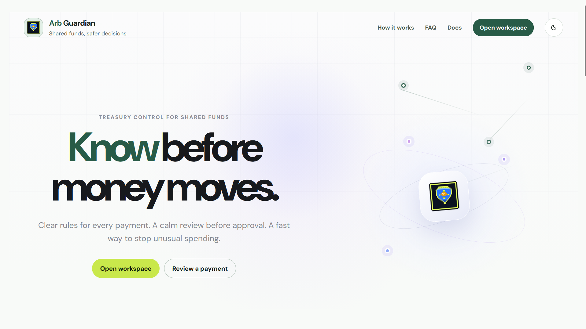
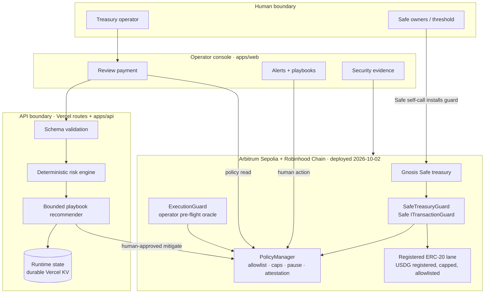

# Arb Guardian

<p align="center">
  
</p>

<p align="center">
  <strong>Bounded spending for agents, bots, and operators.</strong><br />
  A treasury can delegate work without delegating the ability to drain the account.
</p>

<p align="center">
  <a href="https://arb-guardian.sithunyein.com"></a>
  <a href="https://github.com/thesithunyein/arb-guardian/actions/workflows/ci.yml"></a>
  
  
  
</p>

<p align="center">
  
</p>

<p align="center">
  <em>The live landing page at <a href="https://arb-guardian.sithunyein.com">arb-guardian.sithunyein.com</a>.</em>
</p>

**Live product:** [arb-guardian.sithunyein.com](https://arb-guardian.sithunyein.com)
**Repository:** [github.com/thesithunyein/arb-guardian](https://github.com/thesithunyein/arb-guardian)
**Current product status:** the web console, policy admin console and serverless API are live, and
the corrected contracts are deployed on both lanes as of 2026-10-02. `/api/status` reports
`"chainConnected": true`, `"productReady": true`, `"deployment.status": "current"`, and
`/api/health` reports durable KV persistence. A real Gnosis Safe on each lane carries the guard,
installed through that Safe's own `execTransaction`, with an allowed and a refused spend recorded
onchain. All six contracts are source-published: Sourcify reports `exact_match` for both creation and
runtime bytecode on both lanes, and every one of them reads as verified on its own explorer panel
(Arbitrum Sepolia Blockscout, Robinhood Chain Testnet). Arbiscan's own panel is still unpublished —
that needs `ARBISCAN_API_KEY`. An operator freeze drill has also been run end to end against the
live lane: refused decision, on-chain pause, refusal of the spend that normally settles, unpause, and
the spend settling again — 33.8 s, hashes in [`docs/incident-drill.md`](docs/incident-drill.md).

> This README is written for operators. It distinguishes a reproducible local
> proof from a live deployment claim. See [`docs/live-deployment.md`](docs/live-deployment.md) for
> addresses, explorers, and the exact deployment blocker.

## The problem

Teams increasingly give software permission to spend: an AI agent pays vendors, a keeper performs
operations, a DAO pays contributors, and a community fund distributes grants. The usual choices are
unsafe:

- Give a hot key broad access and hope the automation behaves.
- Put funds in a separate wallet and accept that a compromise can still drain it.
- Require a human to approve every transaction and lose the speed that automation was meant to provide.

The missing primitive is an **enforceable bound**. A delegate should be able to perform useful work,
while a contract makes it physically unable to pay an unknown counterparty, exceed a daily budget, use
an approval bypass, or delegate-call into an arbitrary target.

Arb Guardian is built for shared wallets, grant funds, DAO operations, launchpads, and automated
payment accounts. The workflow is understandable without crypto vocabulary: define the rule, review
the request, allow safe spending, and freeze the fund when something looks wrong.

## What the product does

1. **Configure policy**: allowlisted counterparties, native-asset limits, token limits, roles, and a
   pause switch.
2. **Review intent**: inspect amount, destination, asset, rule matches, and a deterministic result.
3. **Enforce at the treasury boundary**: a real Gnosis Safe guard checks the transaction before the
   Safe executes it.
4. **Respond to risk**: create an incident, acknowledge it, recommend a bounded playbook, and let a
   human trigger an emergency pause.
5. **Reconcile later**: every amendment and successful decision carries a version and hash-linked
   policy digest.

The API risk engine is deliberately deterministic. There is no LLM, model provider, hidden prompt,
or autonomous fund movement in this repository.

## Architecture


```mermaid
flowchart TB
  subgraph Human["Human boundary"]
    Operator["Treasury operator"]
    Signers["Safe owners / threshold"]
  end

  subgraph Console["Operator console · apps/web"]
    Review["Review payment"]
    Alerts["Alerts + playbooks"]
    Evidence["Security evidence"]
  end

  subgraph API["API boundary · Vercel routes + apps/api"]
    Validate["Schema validation"]
    Risk["Deterministic risk engine"]
    Coordinator["Bounded playbook recommender"]
    State[("Runtime state\ndurable Vercel KV")]
  end

  subgraph Chain["Arbitrum Sepolia + Robinhood Chain · deployed 2026-10-02"]
    PM["PolicyManager\nallowlist · caps · pause · attestation"]
    EG["ExecutionGuard\noperator pre-flight oracle"]
    STG["SafeTreasuryGuard\nSafe ITransactionGuard"]
    Safe["Gnosis Safe treasury"]
    Token["Registered ERC-20 lane\nUSDG registered, capped, allowlisted"]
  end

  Operator --> Review
  Review --> Validate --> Risk
  Risk --> Coordinator
  Coordinator --> State
  Coordinator -->|human-approved mitigate| PM
  Review -->|policy read| PM
  Alerts -->|human action| PM
  Signers -->|Safe self-call installs guard| Safe
  Safe --> STG
  STG --> PM
  STG --> Token
  EG --> PM
  Evidence --> Chain
```

### Trust boundaries

| Boundary | What it can do | What it cannot do |
| --- | --- | --- |
| Web console | Display requests, submit reviews, request actions | Move funds or change policy by itself |
| API risk engine | Validate input, score intent, create incidents | Override onchain policy or hold keys |
| ExecutionGuard | Pre-flight and record an operator-path spend | Stop a transfer when the operator bypasses it |
| PolicyManager | Own allowlists, caps, roles, pause, and attestation | Move treasury funds |
| SafeTreasuryGuard | Reject unsafe Safe transactions before execution | Change Safe ownership or bypass the Safe threshold |
| Safe owners | Approve Safe self-calls and emergency operations | Make a denied transaction execute through the guard |

## Contract enforcement

The contract package contains three layers:

| Contract | Purpose |
| --- | --- |
| `PolicyManager` | Source of truth for allowlists, native and token daily limits, RBAC, pause, and policy attestation |
| `ExecutionGuard` | Pre-execution validation and spend recording for an operator/API path; holds no funds |
| `SafeTreasuryGuard` | Gnosis Safe v1.4.1 `ITransactionGuard` that checks the Safe's actual `execTransaction` path |

The Safe guard is deny-by-default:

- unknown destinations are rejected;
- zero limits block spending; unlimited spending requires an explicit sentinel;
- native and registered-token lanes have independent caps;
- `approve`, `permit`, and unsupported token calls cannot create a standing bypass;
- `DelegateCall` is rejected;
- spend is recorded before the inner call and refunded if that call fails;
- policy mutations advance a hash-linked version and digest;
- Safe guard installation must be an owner-approved Safe self-call.

The token lane is pointed at the real Paxos Global Dollar contract, and both addresses are read from
the chain rather than asserted:

| Lane | USDG | Verified by direct read |
| --- | --- | --- |
| Arbitrum Sepolia | `0xFFC95faa3d63Cde504a05B567C600B78C0b41892` | symbol, decimals (6), code, live supply |
| Robinhood Chain testnet | `0x7E955252E15c84f5768B83c41a71F9eba181802F` | symbol, decimals (6), code, live supply |

`npm run check:settlement` reads both and fails if either claim stops being true. **A verified token
is not a configured lane**, and the difference between the two is read rather than described: the
same command now reads the lane back from each `PolicyManager` and fails on a mismatch. On both
current deployments it finds the token registered, the enrolled Safe capped at a
`5,000,000,000`-base-unit daily limit (5,000 USDG at 6 decimals), the recipient allowlisted for the
token lane and the native lane, a 5 ETH/day native limit, and the policy unpaused.

What that does **not** mean is that USDG has moved. The treasury holds 0 USDG on both lanes and the
issuer's testnet faucet is geo-restricted from the machine that built this, so no USDG payment has
been executed. The lane's logic is exercised against a USDG-shaped token by
`npm run evidence -w packages/contracts`; its address, decimals and configuration by
`npm run check:settlement`. A bounded payment on a live lane is still pending.

## Why not just an alert, or a multisig

Alerting, multisig review, and guard enforcement are often described as if they were the same control.
They are not: they stop different things at different moments, and only one of them bounds a delegated
spender. The comparison below is about capability classes, not vendors, and it is a design comparison
rather than a security audit of anyone's product.

| Approach | What actually stops an unsafe spend | What a compromised operator key can still do | What it cannot do |
| --- | --- | --- | --- |
| Alerts and monitoring | Nothing at execution time. It detects and notifies. | Everything the key is authorised to do — the alert arrives afterwards. | Bound an automated spender, or fail an unsafe transfer before it lands. |
| Manual multisig review | The signers, per transaction. Strong against one compromised signer. | Spend only up to what other signers accept; social-engineering a signer is the attack. | Express a daily cap or an allowlist deterministically, or keep up with machine-speed payments. |
| Signer-side policy (a bot or service checks before it signs) | The requests that service chooses to send. | Bypass the service entirely: the policy is a wrapper around the key, not a property of the account. | Constrain anyone who can reach the treasury by another path. |
| Guard-enforced policy inside Safe execution (this project) | The Safe's own `execTransaction`, deny-by-default, before the inner call runs. | Only what policy already permits: allowlisted destinations, inside caps, no standing approvals, no delegatecall. | Replace the policy — roles are separate, and a wrong allowlist is still a wrong policy. |

The distinction that matters for agent spending is the third row versus the fourth. A policy that
lives in the process that holds the key disappears the moment something else holds the key; a policy
that lives in the account's execution path does not.

What this project does not claim: the guard cannot make a badly chosen allowlist safe, the pause is
only as fast as the operator who calls it, the policy owner's key is a single point of trust today,
and none of this has been reviewed by a third party. Those are stated in
[`SECURITY.md`](SECURITY.md) rather than left to be discovered.

## Proof you can reproduce

The strongest local proof uses a real Gnosis Safe v1.4.1 singleton, proxy factory, and fallback
handler. It is not a Safe-compatible mock.

```text
15/15 guard cases reproduced
14/14 policy playbook fixtures passed
69 contract tests passed
128 tests across four suites (69 contracts · 25 api · 20 shared · 14 durable store)
```

Run the proof locally:

```bash
npm install
npm run evidence -w packages/contracts
npm run test -w packages/contracts
npm run eval:policy -w apps/api
npm run preflight
```

The evidence pack includes the meaningful before/after case: the same payment is allowed before a
guard is installed and blocked after the real Safe guard is installed. A screenshot of a blocked
simulation alone would not prove enforcement.

Useful artifacts:

- [`packages/contracts/evidence/guard-proof.md`](packages/contracts/evidence/guard-proof.md)
- [`docs/live-deployment.md`](docs/live-deployment.md)
- [`docs/security-ops-runbook.md`](docs/security-ops-runbook.md)
- [`docs/threat-model.md`](docs/threat-model.md)

## Live deployment truth

Both lanes carry the corrected build, deployed 2026-10-02. The public app reports:

```json
{
  "healthy": true,
  "chainConnected": true,
  "productReady": true,
  "deployment": {
    "status": "current"
  }
}
```

Every part of that claim has a command behind it:

- `npm run check:deployed` — 6/6 contracts across both lanes match this source's metadata
  fingerprint and runtime size, read over each network's public RPC. It fails if a lane is declared
  `current` and is not.
- `npm run check:settlement` — real Paxos USDG at both lanes' addresses, `symbol() = USDG`,
  `decimals() = 6`, read from the contracts rather than copied from the docs.
- A real Gnosis Safe v1.4.1 on each lane holds `SafeTreasuryGuard`, installed through the Safe's own
  `execTransaction`, with an allowed spend and a refused spend recorded onchain.
- Source publication: `npm run verify:sourcify` submits the compiler's own standard JSON input for
  all six contracts and reads the verifier back — Sourcify answers `exact_match` for both creation
  and runtime bytecode, and every contract reads as verified on its own explorer panel (Arbitrum
  Sepolia Blockscout, Robinhood Chain). Arbiscan's own panel is the one open item: it needs an
  Arbiscan key, and `npm run verify:arbiscan` is the recorder that finishes, verifies and records it
  the moment one exists.
- `npm run test -w apps/api` — 4 of its 25 tests are read-only `eth_call`s against the live
  `PolicyManager`, so a wrong ABI, a wrong role hash or an undecodable refusal fails the build
  rather than shipping.

Not claimed: mainnet deployment, an independent security review, any pilot usage, and any live USDG
movement (the issuer's testnet faucet is geo-restricted from this machine). The freeze drill is real
traffic but self-operated, and it is described that way. Addresses and transaction hashes are in
[`docs/live-deployment.md`](docs/live-deployment.md); the drill is in
[`docs/incident-drill.md`](docs/incident-drill.md).

Never commit private keys, API keys, or fabricated transaction hashes. Re-running the deployment is
five commands; the first refuses to continue until every prerequisite holds, deriving the deployer
address without printing the key and reading the live balance on each lane.

```bash
npm run deploy:preflight     # refuses until keys and funds hold; names the faucets
npm run redeploy:sepolia     # deploy + seed + enrol, then verify the source
npm run redeploy:robinhood   # the same on the second lane
npm run repoint              # manifest -> current, app constants rewritten, then proved on-chain
npm run preflight            # quality gate + drift + settlement + readiness + push audit
```

## Known gaps

Both lanes are live, byte-matched to this source, and reproducible. This is what is still missing,
stated here rather than left to be discovered:

- **Arbiscan's own source panel is unpublished.** All six contracts are published on Sourcify with
  `exact_match` for creation and runtime bytecode, and each reads as verified on its own explorer
  panel (Arbitrum Sepolia Blockscout, Robinhood Chain Testnet). Arbiscan's panel needs one thing
  that does not exist in this repository: a free Etherscan API key. Put `ARBISCAN_API_KEY=<key>` in
  `.env` and run `npm run verify:arbiscan` - it submits all three contracts from the build-info's
  own compiler input, waits for the queue, reads the result back from Arbiscan, and writes
  `evidence/arbiscan.json`. Without a key it records `pending_key` and exits 0; a key that cannot
  read the panel is recorded as `read_failed` rather than as an unpublished contract. It already
  runs inside `npm run preflight`, so the step happens on the normal path rather than being
  remembered.
- **No pilot usage.** Review time, false positives, blocked unsafe requests and operator response
  time are not measured against a real team yet. The freeze drill is real traffic, but it is
  self-operated and described that way.
- **No independent security review.** [`docs/internal-review.md`](docs/internal-review.md) is
  labelled internal on purpose. Nobody outside this repository has reviewed the guard, the policy
  admin path, or the token decoding.
- **No USDG has moved.** The lane is configured, capped and deny-by-default on both chains, but the
  treasury holds 0 USDG and the issuer's testnet faucet is geo-restricted from the machine that
  built this. A bounded USDG payment on a live lane is still pending.

### USDG references

- [USDG overview](https://globaldollar.com/about-usdg)
- [USDG developer information](https://globaldollar.com/build-with-usdg)
- [Paxos USDG contract repository](https://github.com/paxosglobal/usdg-contract)

Paxos's own testnet page lists both addresses this project uses - Arbitrum Sepolia
(`0xFFC95faa...b41892`) and Robinhood Testnet (`0x7E955252...81802F`) - but the production network
list retrieved during research does not list Arbitrum. So the lane is **real on testnet,
unconfirmed for Arbitrum production**: treat it as USDG-compatible token-lane code until Paxos
confirms production addresses.
## Product walkthrough

The public site starts in light mode and explains the workflow before wallet connection:

1. [Open the landing page](https://arb-guardian.sithunyein.com)
2. Choose **Review a payment** to see a deterministic assessment.
3. Choose **Open workspace** to inspect Overview, Review, Alerts, and Automations.
4. Open the **Trust** tab: every claim in it links to the transaction, contract, or command behind
   it. The settlement-token cards on that screen are read from each chain, including whether the
   USDG lane is actually configured.
5. Use **Docs** for the in-app explanation; use [technical docs](docs/) for implementation detail.

Enforcement evidence:

- [`docs/incident-drill.md`](docs/incident-drill.md) — the freeze drill, with hashes and timings.
- [`docs/internal-review.md`](docs/internal-review.md) — an **internal** review of the enforcement
  path, labelled as internal, listing what the guard does not cover.

## Repository map

```text
apps/web/                 React + Vite operator console
apps/api/                 deterministic risk engine and API service
api/                      Vercel serverless route adapters
packages/contracts/       Solidity contracts, Hardhat tests, evidence generators
packages/shared/          shared schemas, policy types, and client logic
docs/                     architecture, threat model, deployment, and operator runbooks
scripts/                  preflight, drift, and deployment tooling
```

## Development

Requirements: Node.js 20+ and npm.

```bash
npm install
npm run typecheck
npm run lint
npm run test
npm run build
npm run preflight
npm run dev -w apps/web
```

The contract commands use local Hardhat fixtures unless a network and credentials are explicitly
configured. See [`docs/deploy-sepolia.md`](docs/deploy-sepolia.md) and
[`docs/production-readiness-checklist.md`](docs/production-readiness-checklist.md) before any
deployment.

`npm test` runs four suites, and the badge above is their sum rather than a typed number:

| Suite | Tests | What it covers |
| --- | ---: | --- |
| `npm run test -w packages/contracts` | 69 | Policy, limits, approvals, token lane, and a real Gnosis Safe v1.4.1 guard install |
| `npm run test -w apps/api` | 25 | API integration, risk engine, incident store, deployment status, live policy reads |
| `npm run test -w packages/shared` | 20 | Shared policy and risk types |
| `npm run test:api` | 14 | The durable KV layer, including the double-encoded blob it once misread |

Two further suites are evidence rather than tests, and they exit non-zero on drift:
`npm run evidence -w packages/contracts` replays 15 guard cases against a real Safe,
`npm run eval:policy -w apps/api` runs 14 fixed policy-conformance fixtures, and
`npm run check:settlement` reads the token lane back from each chain.

## Security reporting

Please do not open a public issue for a suspected vulnerability. Read
[`SECURITY.md`](SECURITY.md) for the reporting process and supported disclosure expectations.

## Contributing

Contributions should preserve the core safety properties: deny-by-default behavior, explicit
unlimited limits, Safe-native enforcement, no secret material, and reproducible evidence. Start with
[`docs/threat-model.md`](docs/threat-model.md), run `npm run preflight`, and include tests for any
policy or contract change.

## Code of conduct

Participation in this project is governed by [`CODE_OF_CONDUCT.md`](CODE_OF_CONDUCT.md).

## License

MIT
