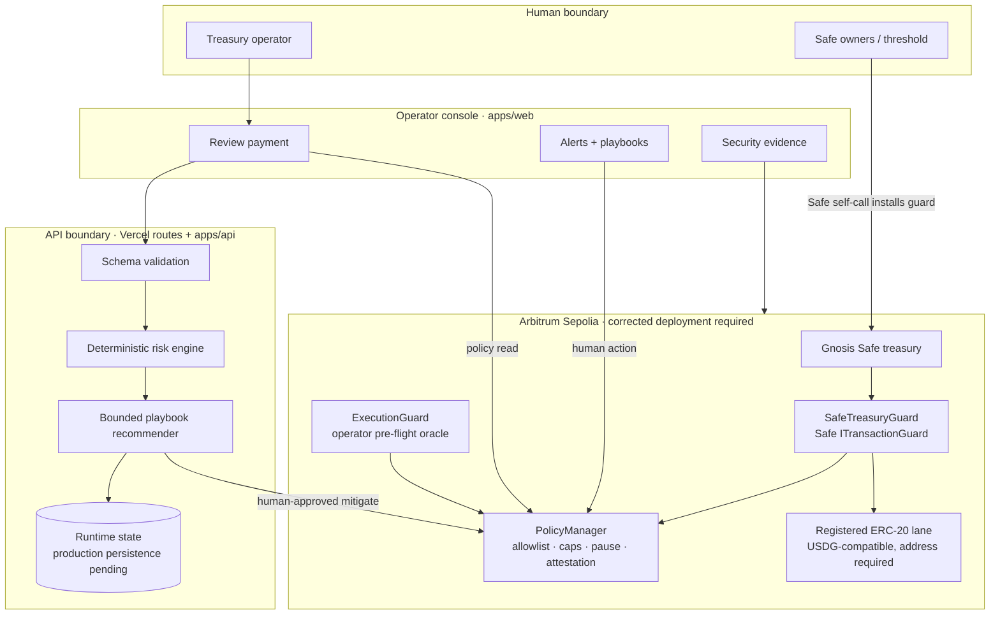

# Arb Guardian

<p align="center">
  
</p>

<p align="center">
  <strong>Bounded spending for agents, bots, and operators.</strong><br />
  A treasury can delegate work without delegating the ability to drain the account.
</p>

<p align="center">
  <a href="https://arb-guardian.sithunyein.com"></a>
  <a href="https://github.com/thesithunyein/arb-guardian/actions/workflows/ci.yml"></a>
  
  
</p>

**Live product:** [arb-guardian.sithunyein.com](https://arb-guardian.sithunyein.com)
**Repository:** [github.com/thesithunyein/arb-guardian](https://github.com/thesithunyein/arb-guardian)
**Current product status:** the web console and deterministic review workflow are live. The recorded
testnet contracts are explicitly marked **superseded** because they predate the current source.
Arb Guardian does not claim current onchain enforcement until corrected contracts are redeployed,
source-verified, and connected to an approved Safe.

> This README is written for operators and judges first. It distinguishes a reproducible local
> proof from a live deployment claim. See [`docs/live-deployment.md`](docs/live-deployment.md) for
> addresses, explorers, and the exact deployment blocker.

## The problem

Teams increasingly give software permission to spend: an AI agent pays vendors, a keeper performs
operations, a DAO pays contributors, and a community fund distributes grants. The usual choices are
unsafe:

- Give a hot key broad access and hope the automation behaves.
- Put funds in a separate wallet and accept that a compromise can still drain it.
- Require a human to approve every transaction and lose the speed that automation was meant to provide.

The missing primitive is an **enforceable bound**. A delegate should be able to perform useful work,
while a contract makes it physically unable to pay an unknown counterparty, exceed a daily budget, use
an approval bypass, or delegate-call into an arbitrary target.

Arb Guardian is built for shared wallets, grant funds, DAO operations, launchpads, and automated
payment accounts. The workflow is understandable without crypto vocabulary: define the rule, review
the request, allow safe spending, and freeze the fund when something looks wrong.

## What the product does

1. **Configure policy**: allowlisted counterparties, native-asset limits, token limits, roles, and a
   pause switch.
2. **Review intent**: inspect amount, destination, asset, rule matches, and a deterministic result.
3. **Enforce at the treasury boundary**: a real Gnosis Safe guard checks the transaction before the
   Safe executes it.
4. **Respond to risk**: create an incident, acknowledge it, recommend a bounded playbook, and let a
   human trigger an emergency pause.
5. **Reconcile later**: every amendment and successful decision carries a version and hash-linked
   policy digest.

The API risk engine is deliberately deterministic. There is no LLM, model provider, hidden prompt,
or autonomous fund movement in this repository.

## Architecture


```mermaid
flowchart TB
  subgraph Human["Human boundary"]
    Operator["Treasury operator"]
    Signers["Safe owners / threshold"]
  end

  subgraph Console["Operator console · apps/web"]
    Review["Review payment"]
    Alerts["Alerts + playbooks"]
    Evidence["Security evidence"]
  end

  subgraph API["API boundary · Vercel routes + apps/api"]
    Validate["Schema validation"]
    Risk["Deterministic risk engine"]
    Coordinator["Bounded playbook recommender"]
    State[("Runtime state\nproduction persistence pending")]
  end

  subgraph Chain["Arbitrum Sepolia · corrected deployment required"]
    PM["PolicyManager\nallowlist · caps · pause · attestation"]
    EG["ExecutionGuard\noperator pre-flight oracle"]
    STG["SafeTreasuryGuard\nSafe ITransactionGuard"]
    Safe["Gnosis Safe treasury"]
    Token["Registered ERC-20 lane\nUSDG-compatible, address required"]
  end

  Operator --> Review
  Review --> Validate --> Risk
  Risk --> Coordinator
  Coordinator --> State
  Coordinator -->|human-approved mitigate| PM
  Review -->|policy read| PM
  Alerts -->|human action| PM
  Signers -->|Safe self-call installs guard| Safe
  Safe --> STG
  STG --> PM
  STG --> Token
  EG --> PM
  Evidence --> Chain
```

### Trust boundaries

| Boundary | What it can do | What it cannot do |
| --- | --- | --- |
| Web console | Display requests, submit reviews, request actions | Move funds or change policy by itself |
| API risk engine | Validate input, score intent, create incidents | Override onchain policy or hold keys |
| ExecutionGuard | Pre-flight and record an operator-path spend | Stop a transfer when the operator bypasses it |
| PolicyManager | Own allowlists, caps, roles, pause, and attestation | Move treasury funds |
| SafeTreasuryGuard | Reject unsafe Safe transactions before execution | Change Safe ownership or bypass the Safe threshold |
| Safe owners | Approve Safe self-calls and emergency operations | Make a denied transaction execute through the guard |

## Contract enforcement

The contract package contains three layers:

| Contract | Purpose |
| --- | --- |
| `PolicyManager` | Source of truth for allowlists, native and token daily limits, RBAC, pause, and policy attestation |
| `ExecutionGuard` | Pre-execution validation and spend recording for an operator/API path; holds no funds |
| `SafeTreasuryGuard` | Gnosis Safe v1.4.1 `ITransactionGuard` that checks the Safe's actual `execTransaction` path |

The Safe guard is deny-by-default:

- unknown destinations are rejected;
- zero limits block spending; unlimited spending requires an explicit sentinel;
- native and registered-token lanes have independent caps;
- `approve`, `permit`, and unsupported token calls cannot create a standing bypass;
- `DelegateCall` is rejected;
- spend is recorded before the inner call and refunded if that call fails;
- policy mutations advance a hash-linked version and digest;
- Safe guard installation must be an owner-approved Safe self-call.

The token lane is token-agnostic and can support USDG once a real token address, treasury, recipient,
and limit are supplied. **USDG is not currently configured in the live evidence.** Do not read the
USDG badge as a claim that a USDG lane is active.

## Proof you can reproduce

The strongest local proof uses a real Gnosis Safe v1.4.1 singleton, proxy factory, and fallback
handler. It is not a Safe-compatible mock.

```text
15/15 guard cases reproduced
14/14 policy playbook fixtures passed
63 contract tests passed
```

Run the proof locally:

```bash
npm install
npm run evidence -w packages/contracts
npm run test -w packages/contracts
npm run eval:policy -w apps/api
npm run preflight
```

The evidence pack includes the meaningful before/after case: the same payment is allowed before a
guard is installed and blocked after the real Safe guard is installed. A screenshot of a blocked
simulation alone would not prove enforcement.

Useful artifacts:

- [`packages/contracts/evidence/guard-proof.md`](packages/contracts/evidence/guard-proof.md)
- [`docs/judging-evidence-matrix.md`](docs/judging-evidence-matrix.md)
- [`docs/demo-runbook.md`](docs/demo-runbook.md)
- [`docs/security-ops-runbook.md`](docs/security-ops-runbook.md)
- [`docs/threat-model.md`](docs/threat-model.md)

## Live deployment truth

Arb Guardian qualifies as a product demo today, not as a claimed current production treasury
enforcement deployment. The public app is live, but `/api/status` reports:

```json
{
  "healthy": true,
  "chainConnected": false,
  "productReady": false,
  "deployment": {
    "status": "superseded",
    "source": "recorded-superseded"
  }
}
```

Recorded addresses are useful historical testnet evidence and remain linked from the UI, but they
run an earlier build. They must not be presented as the current source. The exact addresses,
bytecode-drift result, and redeployment procedure are in [`docs/live-deployment.md`](docs/live-deployment.md).

Required inputs for a real corrected deployment:

- `DEPLOYER_PRIVATE_KEY`, supplied only through a secure environment variable;
- funded Arbitrum Sepolia ETH;
- `ARBISCAN_API_KEY` for source verification;
- Safe owner/operator approval for the guard self-call;
- for USDG: `USDG_ADDRESS`, `USDG_TREASURY_ADDRESS`, `USDG_DAILY_LIMIT_UNITS`, and `USDG_RECIPIENT`;
- durable production storage for incidents, KPI, audit history, and waitlist state.

Never commit private keys, API keys, or fabricated transaction hashes.

## Submission scorecard and the path to 9+

The buildathon page says projects must be deployed on an Arbitrum chain and judges score smart
contract quality, product-market fit, innovation, and real problem solving. USDG receives extra
consideration. The page retrieved for this README explicitly names Arbitrum One and custom Arbitrum
chains; it does not independently confirm that Arbitrum Sepolia qualifies. Confirm that point with
the organizers before relying on a Sepolia-only submission. Based on the published criteria, the
honest current position is:

| Criterion | Current evidence | Honest score today | What moves it to 9+ |
| --- | --- | ---: | --- |
| Smart contract quality | 63 tests, real Safe integration, deny-by-default rules, drift checks | 8/10 | Redeploy corrected source, verify every contract, add independent review or audit, publish gas and invariant results |
| Product-market fit | Live operator workflow, plain-language review, alerts, deterministic playbooks | 7.5/10 | Two or more pilot teams, measurable time-to-review and blocked-risk outcomes, durable audit history, clear pricing/onboarding |
| Innovation | Policy attestation plus Safe-native token/native lanes and bounded playbooks | 8/10 | Prove a differentiated agent-permission workflow, publish comparison against multisig/manual controls, show policy replay in the demo |
| Real problem solving | Blocks before Safe execution and has an emergency pause path | 7/10 | Explorer-verifiable current deployment, a real Safe transaction, a blocked/allowed before-after recording, and a documented incident drill |
| USDG / Arbitrum fit | Token lane implemented and tests cover 6-decimal limits; no live USDG configuration | 5/10 | Configure the real USDG lane, verify token and treasury addresses, demonstrate a bounded USDG payment on the target chain |

### Priority order

1. **Deploy and verify the corrected Arbitrum Sepolia contracts.** Record deployment and verification
   transactions only after explorers confirm bytecode and source.
2. **Install the Safe guard through the Safe self-call flow.** Capture the Safe transaction, guard
   address, threshold, and an allowed/blocked transaction pair.
3. **Configure the real USDG lane if the official token address and operator approval are available.**
   Do not substitute a lookalike token or a placeholder address.
4. **Replace ephemeral Vercel state with durable storage.** Demonstrate that incidents, decisions,
   and audit records survive a new serverless instance.
5. **Run a small pilot.** Measure review time, false positives, blocked unsafe requests, and operator
   response time. Put anonymized results in the submission.
6. **Add independent security evidence.** Publish a focused review of access control, Safe guard
   integration, token decoding, reentrancy/refund ordering, and upgrade/deployment assumptions.
7. **Record a two-minute judge path.** Problem → request → blocked decision → alert → Safe-level
   enforcement → policy digest → explorer proof. Keep every claim linked to a command or transaction.

Until these steps are complete, the strongest submission is an honest “working control plane with
reproducible enforcement proof and a clearly blocked production gate,” not a claim of 9+ readiness.

### Research basis

- [Buildathon brief](https://www.hackquest.io/hackathons/Arbitrum-Open-House-Singapore-Online-Buildathon)
- [Arbitrum chain information](https://docs.arbitrum.io/for-devs/dev-tools-and-resources/chain-info)
- [Arbitrum Open House judging signal](https://blog.arbitrum.foundation/open-house-nyc-buildathon-concludes-meet-the-winning-teams/)
- [USDG overview](https://globaldollar.com/about-usdg)
- [USDG developer information](https://globaldollar.com/build-with-usdg)
- [Paxos USDG contract repository](https://github.com/paxosglobal/usdg-contract)

The official USDG network list retrieved during research does not list Arbitrum. Treat USDG as
**USDG-compatible token-lane code** until Paxos or the organizers provide an official Arbitrum
address and confirm that its use is eligible for extra consideration.

## Product walkthrough

The public site starts in light mode and explains the workflow before wallet connection:

1. [Open the landing page](https://arb-guardian.sithunyein.com)
2. Choose **Review a payment** to see a deterministic assessment.
3. Choose **Open workspace** to inspect Overview, Review, Alerts, and Automations.
4. Use **Docs** for the in-app explanation; use [technical docs](docs/) for implementation detail.

## Repository map

```text
apps/web/                 React + Vite operator console
apps/api/                 deterministic risk engine and API service
api/                      Vercel serverless route adapters
packages/contracts/       Solidity contracts, Hardhat tests, evidence generators
packages/shared/          shared schemas, policy types, and client logic
docs/                     architecture, threat model, deployment, demo, and judging evidence
scripts/                  preflight, drift, submission, and deployment tooling
```

## Development

Requirements: Node.js 20+ and npm.

```bash
npm install
npm run typecheck
npm run lint
npm run test
npm run build
npm run preflight
npm run dev -w apps/web
```

The contract commands use local Hardhat fixtures unless a network and credentials are explicitly
configured. See [`docs/deploy-sepolia.md`](docs/deploy-sepolia.md) and
[`docs/production-readiness-checklist.md`](docs/production-readiness-checklist.md) before any
deployment.

## Security reporting

Please do not open a public issue for a suspected vulnerability. Read
[`SECURITY.md`](SECURITY.md) for the reporting process and supported disclosure expectations.

## Contributing

Contributions should preserve the core safety properties: deny-by-default behavior, explicit
unlimited limits, Safe-native enforcement, no secret material, and reproducible evidence. Start with
[`docs/threat-model.md`](docs/threat-model.md), run `npm run preflight`, and include tests for any
policy or contract change.

## Code of conduct

Participation in this project is governed by [`CODE_OF_CONDUCT.md`](CODE_OF_CONDUCT.md).

## License

MIT
