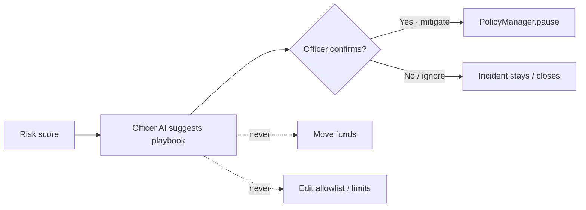
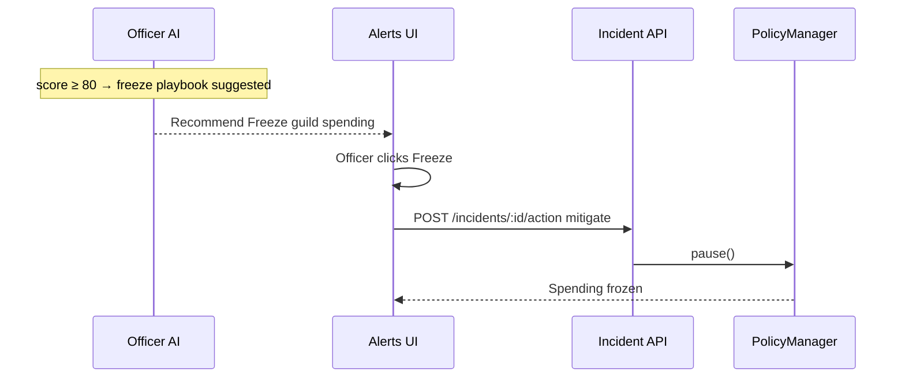
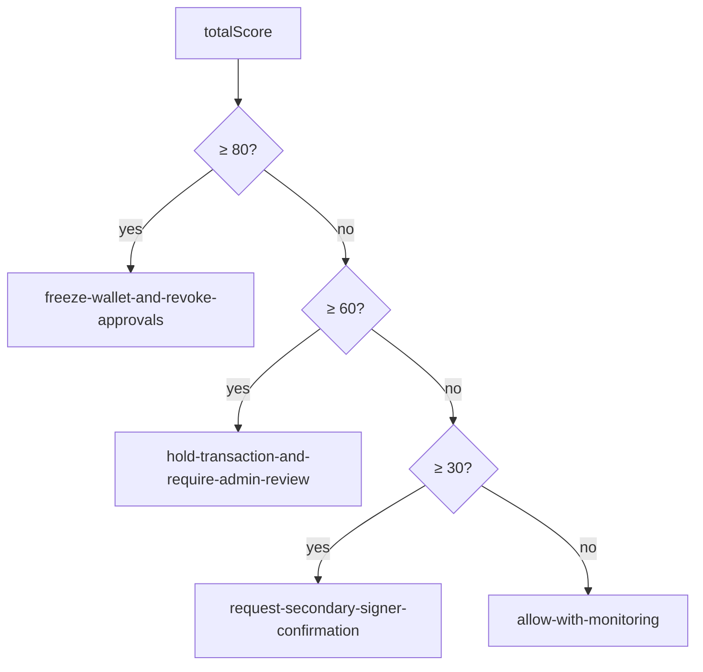

# Officer AI — permissions matrix

Bounded agentic actions only. No free-form tools, no fund movement, no admin changes.

Related: [`architecture.md`](architecture.md) · Live Playbooks tab on [arb-guardian.vercel.app](https://arb-guardian.vercel.app)

---

## Design principle



Officer AI **recommends**. The officer **decides**. Onchain policy **enforces**.

---

## Playbook matrix

| Playbook ID | Score | Auto-execute? | What happens | Human gate |
| --- | ---: | --- | --- | --- |
| `allow-with-monitoring` | 0–29 | No | Allow path · keep watching | None |
| `request-secondary-signer-confirmation` | 30–59 | No | Soft caution · second look | Operator ack |
| `hold-transaction-and-require-admin-review` | 60–79 | Soft | Incident held · no pause | Mitigate / ignore |
| `freeze-wallet-and-revoke-approvals` | ≥80 | **Only after mitigate** | `PolicyManager.pause()` | Officer clicks **Freeze** |

Coordinator: `apps/api/src/agentCoordinator.ts` → `recommendPlaybook()`.  
Executor: `apps/api/src/playbookExecutor.ts` → `executeBoundedPlaybook()` (Vercel: `api/incidents/[id]/action.ts`).

---

## Permission capability map

| Capability | Officer AI | Officer (human) | Onchain contracts |
| --- | --- | --- | --- |
| Score spend / suggest playbook | ✅ | — | — |
| Open alert when blocked | ✅ | — | — |
| Freeze spending (`pause`) | ❌ alone | ✅ via Alerts | ✅ `PolicyManager.pause` |
| Unfreeze (`unpause`) | ❌ | ✅ | ✅ admin / policy path |
| Move guild funds | ❌ | Outside product | Guards may revert unsafe txs |
| Edit allowlist / daily limits | ❌ | Policy admin | ✅ `PolicyManager` admin roles |
| Grant admin roles | ❌ | ❌ in product | ✅ role admin only |
| Bypass `ExecutionGuard` | ❌ | ❌ | Guard is source of truth for validate path |

---

## Critical freeze path



Without the officer click, **no pause** is sent.

---

## Hard bounds (non-negotiable)

1. **Cannot move funds** — no transfer / approve / sweep tools.  
2. **Cannot change policy** — no allowlist or limit writes from the agent.  
3. **Cannot grant roles** — no AccessControl admin from the agent.  
4. **Cannot freeze alone** — `pause()` only after human `mitigate` on the freeze playbook.  
5. **Onchain wins** — `ExecutionGuard.validateAndRecord` / Safe guard still revert bad spends even if the UI is wrong.

---

## Score → playbook (logic)



Block threshold in the risk engine is separate (typically score ≥ 60 → `blocked: true` and an incident opens). Playbook selection uses the bands above.

---

## Eval harness

Measurable trust — not vibes.

```bash
npm run eval:agent -w apps/api
# or live: GET /api/agent/eval
```

| Metric | Target | Current harness |
| --- | --- | --- |
| Scenarios | 12 | `apps/api/src/evaluationScenarios.ts` |
| Accuracy | 1.0 | Pass/fail on blocked + playbook match |
| Precision / recall (blocked) | 1.0 | Reported in eval summary |

Full gate (contracts + API + eval + builds):

```bash
npm run quality:gate
```

---

## What officers see in product

| UI copy | Meaning |
| --- | --- |
| **Suggests: Freeze guild spending** | Playbook recommendation only |
| **Cannot move funds** | Hard bound #1 |
| **Freeze needs a human click** | Hard bound #4 |
| Playbooks · **12/12 · 100%** | Eval harness result surfaced as trust |

---

## Threat model (agent-focused)

| Threat | Mitigation |
| --- | --- |
| Agent drains treasury | No fund-moving tools; guards onchain |
| Agent pauses forever without oversight | Pause only via officer mitigate |
| Prompt injection / free-form tools | No LLM tool loop — deterministic coordinator |
| UI spoofing allow | ExecutionGuard / SafeTreasuryGuard still enforce |
