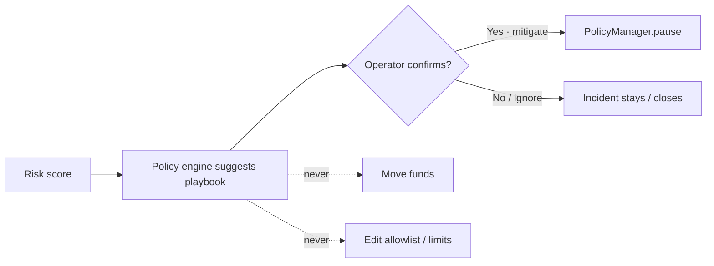
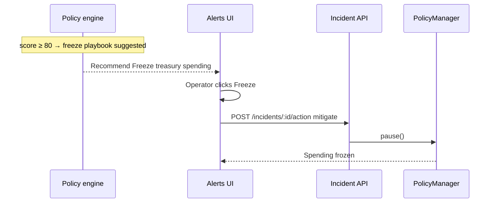
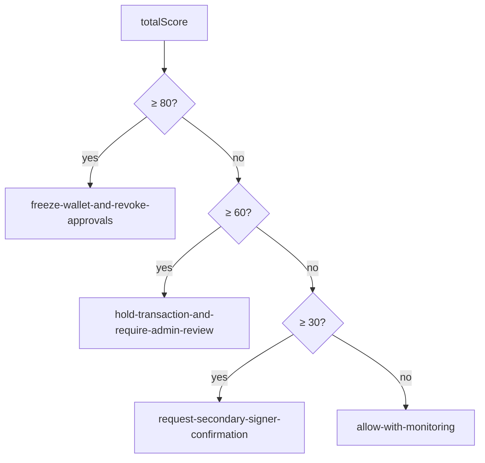

# Policy engine — permissions matrix

Bounded deterministic actions only. No model, no free-form tools, no fund movement, no admin changes.

**There is no AI in Arb Guardian.** The playbook recommender is a four-branch rule ladder in
`apps/api/src/agentCoordinator.ts`. It is deliberately named a *policy engine* here so the
permission surface matches what the code actually does. See the threat-model row on prompt
injection below for why this is a design choice rather than a missing feature.

Related: [`architecture.md`](architecture.md) · Live Playbooks tab on [arb-guardian.vercel.app](https://arb-guardian.vercel.app)

---

## Design principle


```mermaid
flowchart LR
  Score[Risk score] --> Suggest[Policy engine suggests playbook]
  Suggest --> Human{Operator confirms?}
  Human -->|Yes · mitigate| Pause[PolicyManager.pause]
  Human -->|No / ignore| Hold[Incident stays / closes]
  Suggest -.->|never| Funds[Move funds]
  Suggest -.->|never| Policy[Edit allowlist / limits]
```

The policy engine **recommends**. The operator **decides**. Onchain policy **enforces**.

---

## Playbook matrix

| Playbook ID | Score | Auto-execute? | What happens | Human gate |
| --- | ---: | --- | --- | --- |
| `allow-with-monitoring` | 0–29 | No | Allow path · keep watching | None |
| `request-secondary-signer-confirmation` | 30–59 | No | Soft caution · second look | Operator ack |
| `hold-transaction-and-require-admin-review` | 60–79 | Soft | Incident held · no pause | Mitigate / ignore |
| `freeze-wallet-and-revoke-approvals` | ≥80 | **Only after mitigate** | `PolicyManager.pause()` | Operator clicks **Freeze** |

Coordinator: `apps/api/src/agentCoordinator.ts` → `recommendPlaybook()`.
Executor: `apps/api/src/playbookExecutor.ts` → `executeBoundedPlaybook()` (Vercel: `api/incidents/[id]/action.ts`).

---

## Rules that produce the score

The score comes from `apps/api/src/riskEngine.ts`. Every rule is deny-by-default:

| Rule | Trigger | Delta |
| --- | --- | ---: |
| `RULE_ALLOWLIST_DESTINATION` | Destination not on the treasury allowlist | +60 |
| `RULE_DAILY_LIMIT_NOT_CONFIGURED` | Wallet/Safe has no limit set (0) — cannot spend at all | +60 |
| `RULE_DAILY_LIMIT` | Projected spend exceeds the configured limit | +60 |
| `RULE_APPROVAL_SURFACE` | `approve`, `increaseAllowance`, `permit`, `setApprovalForAll` (by name **or** selector) | +60 |

Block threshold is `totalScore >= 60`, so **each of these four rules can block on its own**.
An approval to an allowlisted destination inside the limit still blocks: granting standing
spending authority requires an explicit human release.

---

## Permission capability map

| Capability | Policy engine | Operator (human) | Onchain contracts |
| --- | --- | --- | --- |
| Score spend / suggest playbook | ✅ | — | — |
| Open alert when blocked | ✅ | — | — |
| Freeze spending (`pause`) | ❌ alone | ✅ via Alerts | ✅ `PolicyManager.pause` |
| Unfreeze (`unpause`) | ❌ | ✅ | ✅ admin / policy path |
| Move treasury funds | ❌ | Outside product | Guards revert unsafe txs |
| Edit allowlist / daily limits | ❌ | Policy admin | ✅ `PolicyManager` admin roles |
| Grant admin roles | ❌ | ❌ in product | ✅ role admin only |
| Bypass `ExecutionGuard` | ❌ | ❌ | Guard is source of truth for validate path |

---

## Critical freeze path


```mermaid
sequenceDiagram
  participant PE as Policy engine
  participant UI as Alerts UI
  participant API as Incident API
  participant PM as PolicyManager

  Note over PE: score ≥ 80 → freeze playbook suggested
  PE-->>UI: Recommend Freeze treasury spending
  UI->>UI: Operator clicks Freeze
  UI->>API: POST /incidents/:id/action mitigate
  API->>PM: pause()
  PM-->>UI: Spending frozen
```

Without the operator click, **no pause** is sent.

---

## Hard bounds (non-negotiable)

1. **Cannot move funds** — no transfer / approve / sweep tools.
2. **Cannot change policy** — no allowlist or limit writes from the engine.
3. **Cannot grant roles** — no AccessControl admin from the engine.
4. **Cannot freeze alone** — `pause()` only after human `mitigate` on the freeze playbook.
5. **Onchain wins** — `ExecutionGuard.validateAndRecord` / `SafeTreasuryGuard.checkTransaction` still revert bad spends even if the UI is wrong.

---

## Score → playbook (logic)


```mermaid
flowchart TD
  S[totalScore] --> A{≥ 80?}
  A -->|yes| F[freeze-wallet-and-revoke-approvals]
  A -->|no| B{≥ 60?}
  B -->|yes| H[hold-transaction-and-require-admin-review]
  B -->|no| C{≥ 30?}
  C -->|yes| R[request-secondary-signer-confirmation]
  C -->|no| M[allow-with-monitoring]
```

Block threshold is `totalScore >= 60`. Playbook selection uses the bands above.

---

## Policy conformance fixtures

Not "measurable trust". These are **regression fixtures**: fixed cases whose expected
outcomes were authored alongside the rules, so a pass means the engine still reproduces its
written specification. It does **not** measure generalisation, and it is **not** model
validation — there is no model to validate.

```bash
npm run eval:policy -w apps/api
# or live: GET /api/agent/eval
```

| Metric | Value | Source |
| --- | --- | --- |
| Fixtures | 14 | `apps/api/src/evaluationScenarios.ts` |
| `conformanceRate` | 1.0 | Pass/fail on blocked + playbook match |
| Precision / recall (blocked) | 1.0 | Reported in the summary |

A `conformanceRate` of 1.0 on author-written fixtures is expected, not impressive. Treat it as
a CI guard against silent rule drift.

Full gate (contracts + API + conformance + builds):

```bash
npm run quality:gate
```

---

## What operators see in product

| UI copy | Meaning |
| --- | --- |
| **Suggests: Freeze treasury spending** | Playbook recommendation only |
| **Cannot move funds** | Hard bound #1 |
| **Freeze needs a human click** | Hard bound #4 |
| Playbooks · **fixed policy cases match spec** | Conformance fixture count, labelled as such |

---

## Threat model (engine-focused)

| Threat | Mitigation |
| --- | --- |
| Engine drains treasury | No fund-moving tools; guards onchain |
| Engine pauses forever without oversight | Pause only via operator mitigate |
| Prompt injection / free-form tools | **No LLM at all** — deterministic rules, so this attack class does not apply |
| UI spoofs an allow | `ExecutionGuard` / `SafeTreasuryGuard` still enforce onchain |
| Limit never configured, so spend is unbounded | Deny-by-default: 0 means no spending; `UNLIMITED_LIMIT` must be explicit |
| Approval drain via `increaseAllowance` / `permit` | Approval-class calls block by default, matched by name and selector |
| Failed transaction silently burns the daily budget | `checkAfterExecution` refunds on failure |
