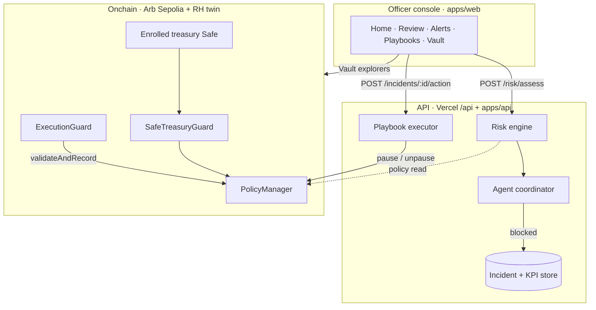
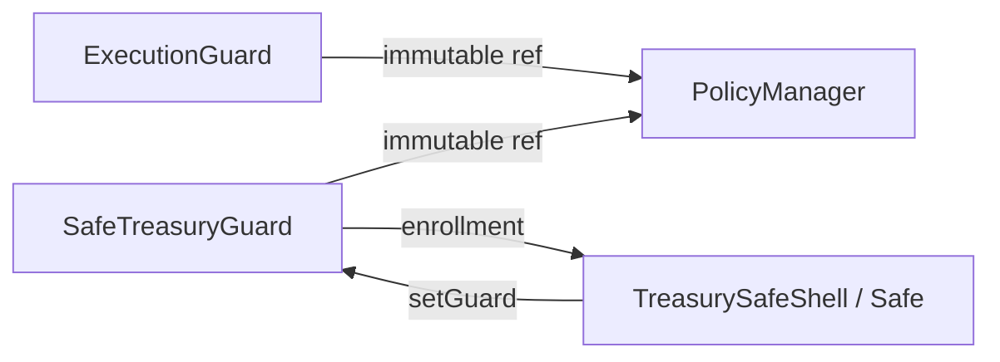
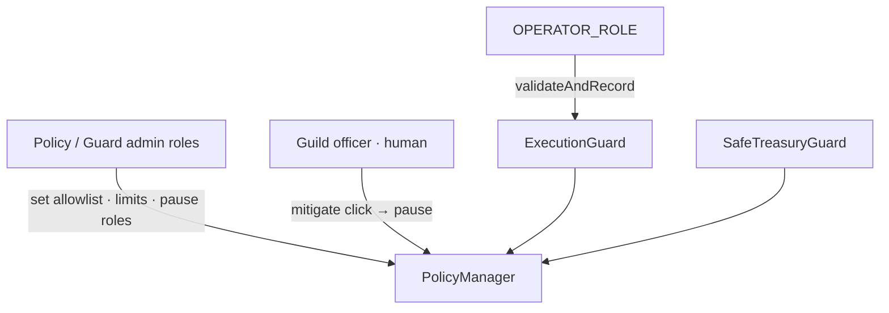
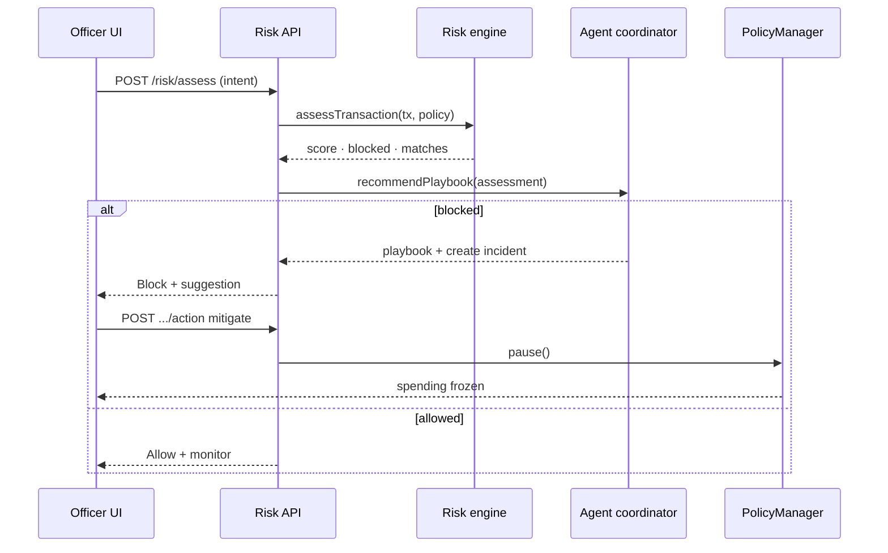
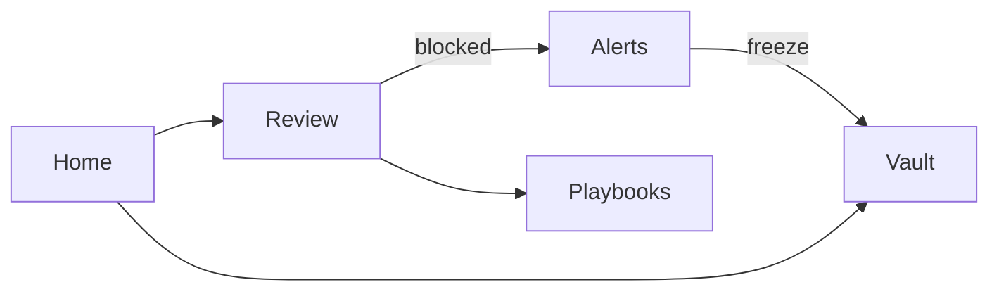
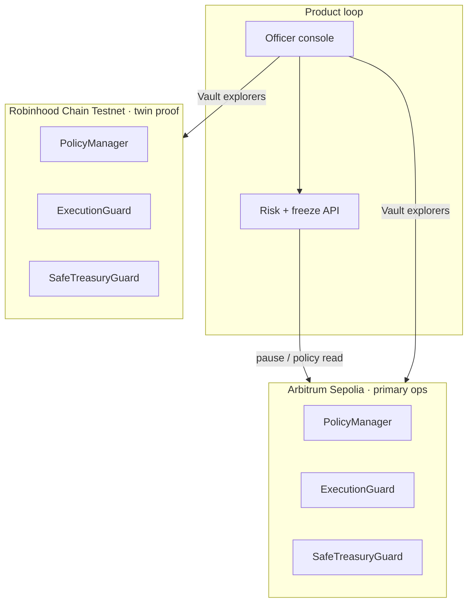
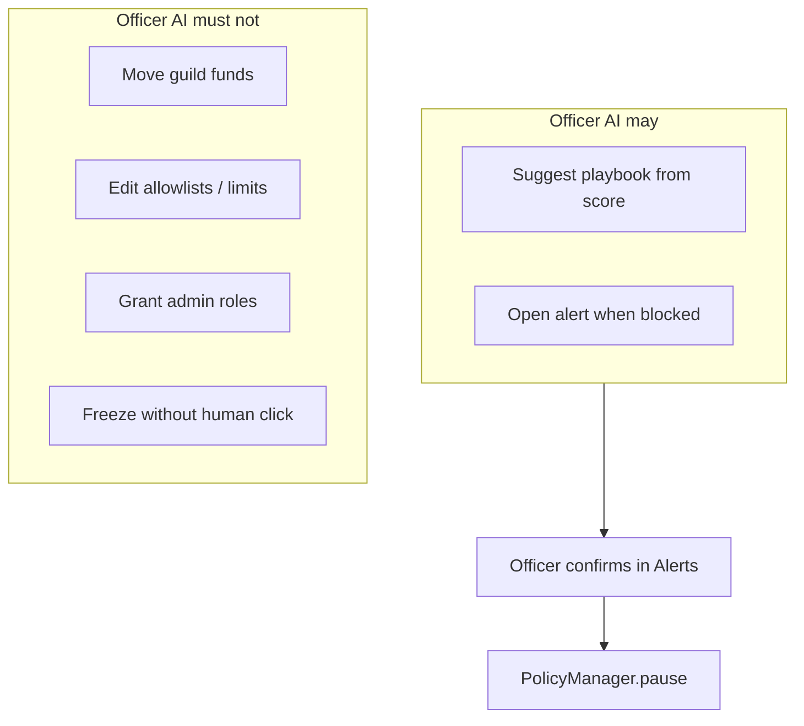

# Architecture

Arb Guardian is a dual-chain guild-bank protection stack: onchain policy + guards, a deterministic risk engine, a bounded Officer AI, and an officer console.

Live product: [arb-guardian.vercel.app](https://arb-guardian.vercel.app)

---

## System overview



---

## Component map

| Layer | Package / path | Responsibility |
| --- | --- | --- |
| Officer console | `apps/web` | Review spends, alerts, playbooks, Vault proof |
| Risk engine | `apps/api/src/riskEngine.ts` · `api/risk/assess.ts` | Deterministic scoring + block decision |
| Agent coordinator | `apps/api/src/agentCoordinator.ts` | Score → playbook (bounded) |
| Playbook executor | `apps/api/src/playbookExecutor.ts` · `api/incidents/[id]/action.ts` | Human-gated mitigate → `pause()` |
| Policy source of truth | `packages/contracts/.../PolicyManager.sol` | Allowlist, daily limits, RBAC, Pausable |
| Pre-exec guard | `ExecutionGuard.sol` | `validateAndRecord` for operator/API path |
| Safe guard | `SafeTreasuryGuard.sol` | Safe `ITransactionGuard` for enrolled treasuries |
| Shared types | `packages/shared` | Assessment / incident schemas |

---

## Onchain design

### Contract graph



Deploy order: **PolicyManager → ExecutionGuard → SafeTreasuryGuard** (`packages/contracts/scripts/deploy.ts`).

### Responsibilities

| Contract | Key surface | Notes |
| --- | --- | --- |
| **PolicyManager** | `setCounterparty`, `setWalletDailyLimit`, `pause` / `unpause` | OZ `AccessControl` + `Pausable` |
| **ExecutionGuard** | `validateAndRecord(wallet, destination, amountWei, methodSelector)` | Allowlist + daily limit; records spend; reverts when paused |
| **SafeTreasuryGuard** | `checkTransaction(...)` | Same rules for Safe txs; blocks `DelegateCall` |
| **TreasurySafeShell** | `execTransaction` | Demo enrolled Safe shell for guard path |

### Trust boundary (onchain)



- Changing allowlists / limits requires policy admin — **not** the agent.  
- Freeze on the critical path is **officer-gated** (`mitigate` → `PolicyManager.pause()`).  
- Guards refuse unsafe counterparties and over-limit spends even if the UI is bypassed.

---

## Offchain decision path

### Review → alert → freeze



### Scoring model (deterministic)

| Rule | Typical delta | Intent |
| --- | --- | --- |
| Destination not allowlisted | +60 | Unknown marketplace / drain path |
| Daily limit exceeded | +60 | Over prize / payout budget |
| Approval surface | +20 | `approve`-style risk |

- **Blocked** when total score ≥ 60 (engine threshold).  
- Playbooks (coordinator):

| Score | Playbook |
| ---: | --- |
| 0–29 | `allow-with-monitoring` |
| 30–59 | `request-secondary-signer-confirmation` |
| 60–79 | `hold-transaction-and-require-admin-review` |
| ≥80 | `freeze-wallet-and-revoke-approvals` |

Full bounds: [`agent-permissions-matrix.md`](agent-permissions-matrix.md).

---

## Officer console surfaces



| Tab | Role in the system |
| --- | --- |
| **Home** | Bank status, session KPIs, waitlist |
| **Review** | Spend receipt → assess → Allow/Block |
| **Alerts** | Incident queue · freeze / dismiss |
| **Playbooks** | Catalog + eval accuracy (12/12 harness) |
| **Vault** | Explorer links for Arb + Robinhood contracts |

Web entry: `apps/web/src/App.tsx` · config: `apps/web/src/config.ts`.

---

## Dual-chain topology

Same Solidity artifact set; two live networks.



| | Arbitrum Sepolia | Robinhood testnet |
| --- | --- | --- |
| Chain ID | `421614` | `46630` |
| Role | Primary runtime for policy pause / validation | Twin deploy for reserved-lane proof |
| Docs | [`live-deployment.md`](live-deployment.md) | same |

Hardhat networks: `packages/contracts/hardhat.config.ts` (`arbitrumSepolia`, `robinhoodTestnet`).

---

## API surface

### Production (Vercel)

Rewrite: `/api/*` → `api/*` handlers. Shared ephemeral store: `api/_store.ts`.

| Route | Purpose |
| --- | --- |
| `GET /api/health` | Liveness |
| `GET /api/status` | Deployment + KPI snapshot |
| `POST /api/risk/assess` | Score intent · open incident if blocked |
| `GET /api/incidents` | Alert queue |
| `POST /api/incidents/:id/action` | `acknowledge` · `mitigate` · `ignore` |
| `GET|POST /api/policy` | Read / pause / unpause |
| `GET /api/agent/eval` | Eval summary |
| `GET|POST /api/waitlist` | Guild officer interest |

### Local Express (`apps/api`)

Richer chain tooling on the same model: `/chain/validate`, `/chain/sync-events`, `/policy/state`, plus the assess / incident routes above (`apps/api/src/server.ts`).

---

## Security & agent bounds



Eval harness (target accuracy 1.0):

```bash
npm run eval:agent -w apps/api
```

Quality gate (contracts + API + eval + builds):

```bash
npm run quality:gate
```

---

## Repository layout

```
apps/web          Officer console (React + Vite)
apps/api          Express API + risk/agent packages
api/              Vercel serverless adapters
packages/contracts  Solidity + Hardhat
packages/shared     Shared Zod/types
docs/               Architecture, deployment, agent matrix
```

---

## Related docs

- [`live-deployment.md`](live-deployment.md) — addresses + explorers  
- [`agent-permissions-matrix.md`](agent-permissions-matrix.md) — playbooks and hard limits  
- [`sep13-submission-copy.md`](sep13-submission-copy.md) — submission one-pager  
