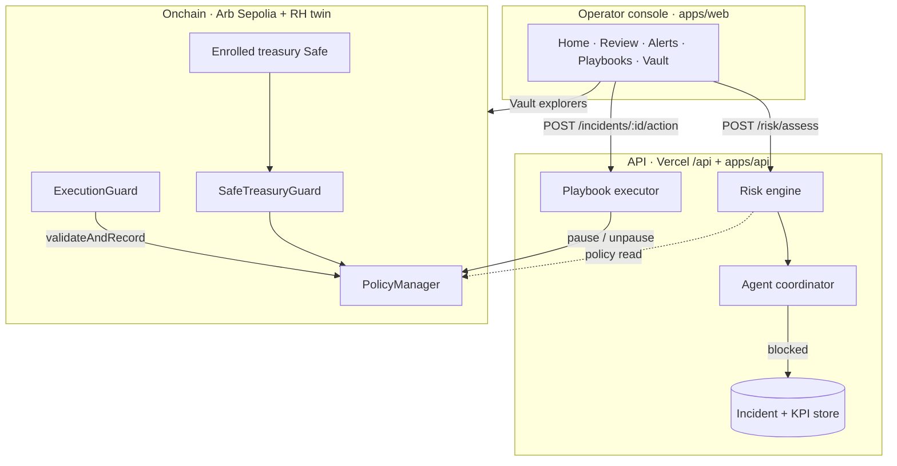
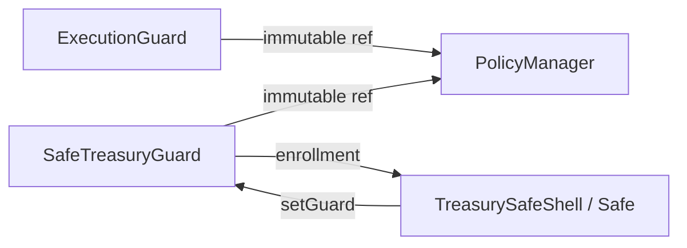
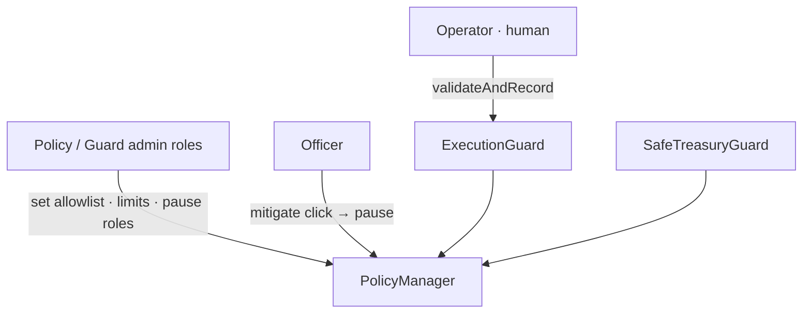
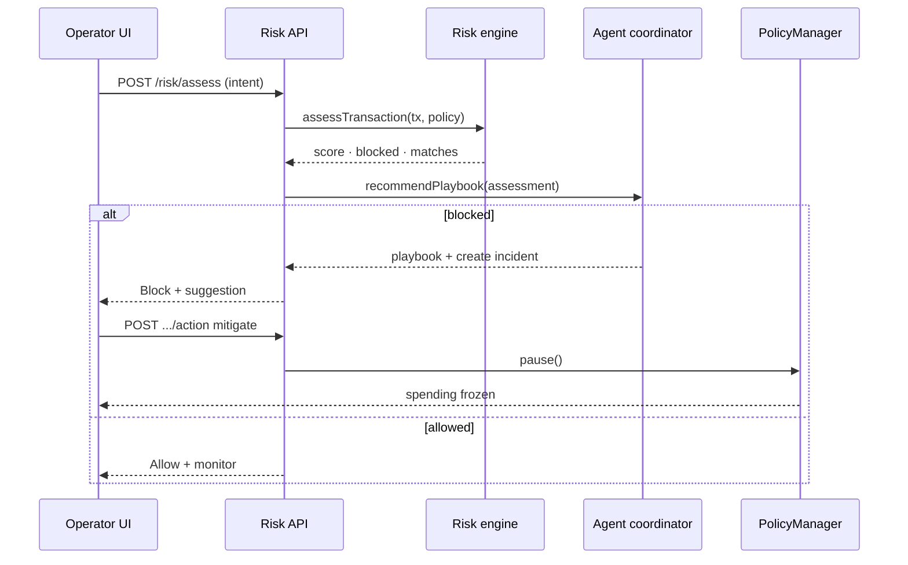
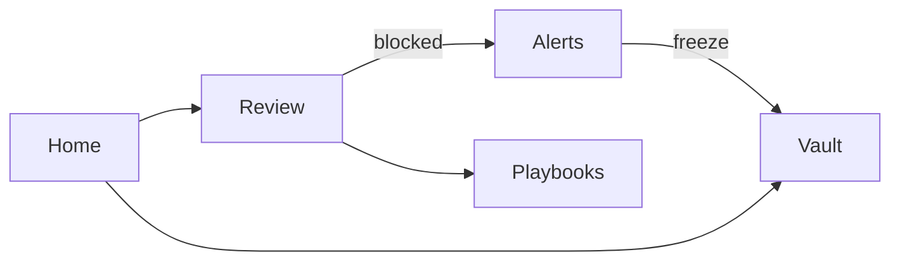
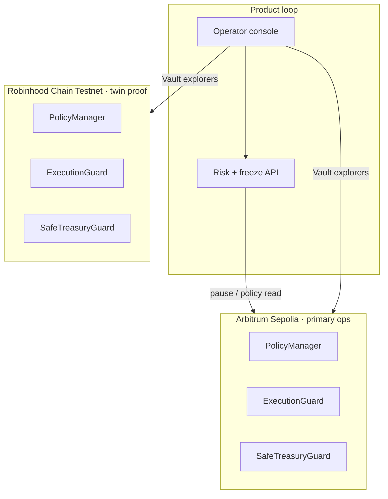
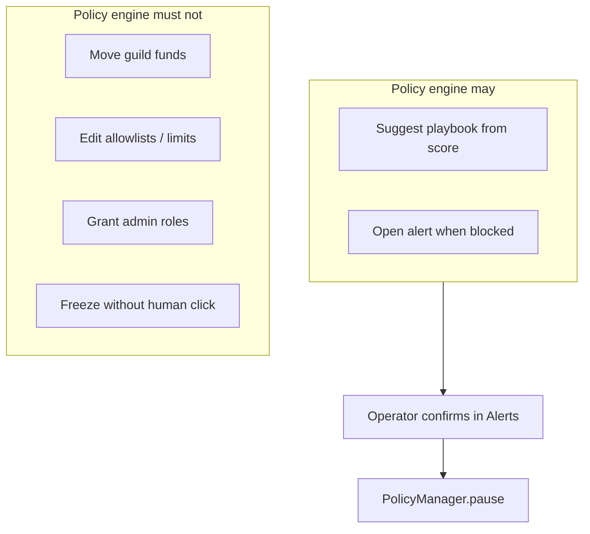

# Architecture

Arb Guardian is a dual-chain delegated-spend control stack: onchain policy + guards, a deterministic risk engine, a policy playbook engine (no model in the loop), and an operator console. Deployments and proof live in the repo; see `docs/judging-evidence-matrix.md` for where each claim is checked.

Live product: [arb-guardian.vercel.app](https://arb-guardian.vercel.app)

---

## System overview


```mermaid
flowchart TB
  subgraph Officer["Operator console · apps/web"]
    UI[Home · Review · Alerts · Playbooks · Vault]
  end

  subgraph Edge["API · Vercel /api + apps/api"]
    RE[Risk engine]
    AC[Agent coordinator]
    PE[Playbook executor]
    Store[(Incident + KPI store)]
  end

  subgraph Onchain["Onchain · Arb Sepolia + RH twin"]
    PM[PolicyManager]
    EG[ExecutionGuard]
    STG[SafeTreasuryGuard]
    Safe[Enrolled treasury Safe]
  end

  UI -->|POST /risk/assess| RE
  RE --> AC
  AC -->|blocked| Store
  UI -->|POST /incidents/:id/action| PE
  PE -->|pause / unpause| PM
  RE -.->|policy read| PM
  EG -->|validateAndRecord| PM
  Safe --> STG
  STG --> PM
  UI -->|Vault explorers| Onchain
```

---

## Component map

| Layer | Package / path | Responsibility |
| --- | --- | --- |
| Operator console | `apps/web` | Review spends, alerts, playbooks, Vault proof |
| Risk engine | `apps/api/src/riskEngine.ts` · `api/risk/assess.ts` | Deterministic scoring + block decision |
| Agent coordinator | `apps/api/src/agentCoordinator.ts` | Score → playbook (bounded) |
| Playbook executor | `apps/api/src/playbookExecutor.ts` · `api/incidents/[id]/action.ts` | Human-gated mitigate → `pause()` |
| Policy source of truth | `packages/contracts/.../PolicyManager.sol` | Allowlist, daily limits, RBAC, Pausable |
| Pre-exec guard | `ExecutionGuard.sol` | `validateAndRecord` for operator/API path |
| Safe guard | `SafeTreasuryGuard.sol` | Safe `ITransactionGuard` for enrolled treasuries |
| Shared types | `packages/shared` | Assessment / incident schemas |

---

## Onchain design

### Contract graph


```mermaid
flowchart LR
  PM[PolicyManager]
  EG[ExecutionGuard]
  STG[SafeTreasuryGuard]
  Shell[TreasurySafeShell / Safe]

  EG -->|immutable ref| PM
  STG -->|immutable ref| PM
  Shell -->|setGuard| STG
  STG -->|enrollment| Shell
```

Deploy order: **PolicyManager → ExecutionGuard → SafeTreasuryGuard** (`packages/contracts/scripts/deploy.ts`).

### Responsibilities

| Contract | Key surface | Notes |
| --- | --- | --- |
| **PolicyManager** | `setCounterparty`, `setWalletDailyLimit` (native), `setTokenRegistered`, `setTokenCounterparty`, `setTokenDailyLimit` (token lane), `pause` / `unpause`, `policySnapshot` | OZ `AccessControl` + `Pausable`; **every mutation advances the policy attestation chain** |
| **ExecutionGuard** | `validateAndRecord(...)`, `validateTokenTransfer(...)`, `validateTokenApproval(...)` | Allowlist + per-asset daily caps; records spend; reverts when paused; stamps each decision with the policy version/digest in force |
| **SafeTreasuryGuard** | `checkTransaction(...)` | Same rules inside a real Safe's `execTransaction`; blocks `DelegateCall`; refunds budget on inner failure |
| **TreasurySafeShell** | `execTransaction` | Demo enrolled Safe shell for guard path |

### Policy attestation

Policy state is not just mutable, it is *versioned*. Each amendment folds into a running hash:

```
digest[n] = keccak256(abi.encode(digest[n-1], n, kind, params))      // digest[-1] = genesisSeed
genesisSeed = keccak256("arb-guardian.policy.genesis" || chainId)
```

`PolicyAmended(version, digest, kind, params, actor)` emits the parameters verbatim, so a third
party can recompute the entire chain from logs without trusting the contract's storage, and any
edit to an earlier amendment changes every later digest. Guard decision events carry the version
and digest that judged them, which is what makes an executed spend reconcilable against the
policy in force at that block. Verified end to end in `test/PolicyAttestation.test.ts` and
replayed by the evidence pack.


### Trust boundary (onchain)


```mermaid
flowchart TB
  Admin[Policy / Guard admin roles]
  Operator[OPERATOR_ROLE]
  Operator[Operator · human]

  Admin -->|set allowlist · limits · pause roles| PM[PolicyManager]
  Operator -->|validateAndRecord| EG[ExecutionGuard]
  Officer -->|mitigate click → pause| PM
  EG --> PM
  STG[SafeTreasuryGuard] --> PM
```

- Changing allowlists / limits requires policy admin — **not** the agent.  
- Freeze on the critical path is **operator-gated** (`mitigate` → `PolicyManager.pause()`).  
- Guards refuse unsafe counterparties and over-limit spends even if the UI is bypassed.

---

## Offchain decision path

### Review → alert → freeze


```mermaid
sequenceDiagram
  participant O as Operator UI
  participant API as Risk API
  participant RE as Risk engine
  participant AC as Agent coordinator
  participant PM as PolicyManager

  O->>API: POST /risk/assess (intent)
  API->>RE: assessTransaction(tx, policy)
  RE-->>API: score · blocked · matches
  API->>AC: recommendPlaybook(assessment)
  alt blocked
    AC-->>API: playbook + create incident
    API-->>O: Block + suggestion
    O->>API: POST .../action mitigate
    API->>PM: pause()
    PM-->>O: spending frozen
  else allowed
    API-->>O: Allow + monitor
  end
```

### Scoring model (deterministic)

| Rule | Typical delta | Intent |
| --- | --- | --- |
| Destination not allowlisted | +60 | Unknown marketplace / drain path |
| Daily limit exceeded | +60 | Over prize / payout budget |
| Approval surface | +20 | `approve`-style risk |

- **Blocked** when total score ≥ 60 (engine threshold).  
- Playbooks (coordinator):

| Score | Playbook |
| ---: | --- |
| 0–29 | `allow-with-monitoring` |
| 30–59 | `request-secondary-signer-confirmation` |
| 60–79 | `hold-transaction-and-require-admin-review` |
| ≥80 | `freeze-wallet-and-revoke-approvals` |

Full bounds: [`agent-permissions-matrix.md`](agent-permissions-matrix.md).

---

## Operator console surfaces


```mermaid
flowchart LR
  Home --> Review
  Review -->|blocked| Alerts
  Alerts -->|freeze| Vault
  Review --> Playbooks
  Home --> Vault
```

| Tab | Role in the system |
| --- | --- |
| **Home** | Bank status, session KPIs, waitlist |
| **Review** | Spend receipt → assess → Allow/Block |
| **Alerts** | Incident queue · freeze / dismiss |
| **Playbooks** | Catalog + policy conformance fixtures (14 fixed cases) |
| **Vault** | Explorer links for Arb + Robinhood contracts |

Web entry: `apps/web/src/App.tsx` · config: `apps/web/src/config.ts`.

---

## Dual-chain topology

Same Solidity artifact set; two live networks.


```mermaid
flowchart TB
  subgraph Product["Product loop"]
    UI[Operator console]
    API[Risk + freeze API]
  end

  subgraph Arb["Arbitrum Sepolia · primary ops"]
    APM[PolicyManager]
    AEG[ExecutionGuard]
    ASTG[SafeTreasuryGuard]
  end

  subgraph RH["Robinhood Chain Testnet · twin proof"]
    RPM[PolicyManager]
    REG[ExecutionGuard]
    RSTG[SafeTreasuryGuard]
  end

  UI --> API
  API -->|pause / policy read| Arb
  UI -->|Vault explorers| Arb
  UI -->|Vault explorers| RH
```

| | Arbitrum Sepolia | Robinhood testnet |
| --- | --- | --- |
| Chain ID | `421614` | `46630` |
| Role | Primary runtime for policy pause / validation | Twin deploy for reserved-lane proof |
| Docs | [`live-deployment.md`](live-deployment.md) | same |

Hardhat networks: `packages/contracts/hardhat.config.ts` (`arbitrumSepolia`, `robinhoodTestnet`).

---

## API surface

### Production (Vercel)

Rewrite: `/api/*` → `api/*` handlers. Shared ephemeral store: `api/_store.ts`.

| Route | Purpose |
| --- | --- |
| `GET /api/health` | Liveness |
| `GET /api/status` | Deployment + KPI snapshot |
| `POST /api/risk/assess` | Score intent · open incident if blocked |
| `GET /api/incidents` | Alert queue |
| `POST /api/incidents/:id/action` | `acknowledge` · `mitigate` · `ignore` |
| `GET|POST /api/policy` | Read / pause / unpause |
| `GET /api/agent/eval` | Eval summary |
| `GET|POST /api/waitlist` | Pilot / operator interest |

### Local Express (`apps/api`)

Richer chain tooling on the same model: `/chain/validate`, `/chain/sync-events`, `/policy/state`, plus the assess / incident routes above (`apps/api/src/server.ts`).

---

## Security & engine bounds


```mermaid
flowchart TB
  subgraph Allowed["Policy engine may"]
    A1[Suggest playbook from score]
    A2[Open alert when blocked]
  end

  subgraph Denied["Policy engine must not"]
    D1[Move guild funds]
    D2[Edit allowlists / limits]
    D3[Grant admin roles]
    D4[Freeze without human click]
  end

  Allowed --> Human[Operator confirms in Alerts]
  Human --> Pause[PolicyManager.pause]
```

Policy conformance fixtures (regression suite — **not** model validation):

```bash
npm run eval:policy -w apps/api
```

Quality gate (contracts + API + conformance + builds):

```bash
npm run quality:gate
```

---

## Repository layout

```
apps/web          Operator console (React + Vite)
apps/api          Express API + risk/agent packages
api/              Vercel serverless adapters
packages/contracts  Solidity + Hardhat
packages/shared     Shared Zod/types
docs/               Architecture, deployment, agent matrix
```

---

## Related docs

- [`live-deployment.md`](live-deployment.md) — addresses + explorers  
- [`agent-permissions-matrix.md`](agent-permissions-matrix.md) — playbooks and hard limits  
- [`sep13-submission-copy.md`](sep13-submission-copy.md) — submission one-pager  
